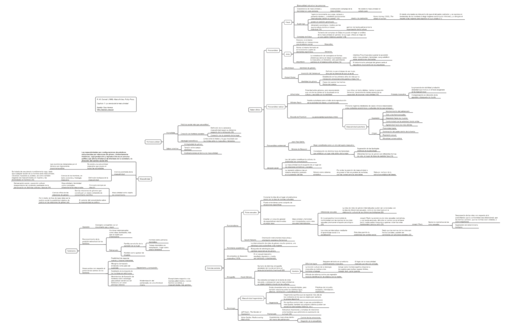

Resumen del capítulo 1 del libro Masculinidades, de R. W. Connell, que habla sobre la forma en que se ha estudiado la masculinidad en distintas disciplinas como la psicología, antropología, historia y sociología. Útil para indagar en los orígenes del concepto de masculinidad, y sus primeros referentes.

_R. W. Connell. (1995). Masculinities. Polity Press_

Clic en el mapa conceptual o en [este link para acceder al resumen.](http://bastian.olea.biz/wp-content/uploads/2022/12/Connell-Masculinidades-cap.-1.pdf)

