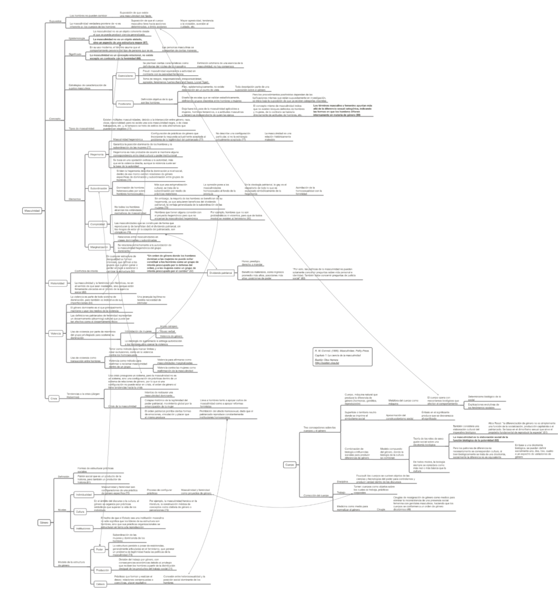

Resumen del capítulo 2 del libro Masculinidades, de R. W. Connell, que plantea un marco general para entender el concepto de masculinidad, su relación con el género y el cuerpo, y algunos elementos que componen la masculinidad.

_R. W. Connell. (1995). Masculinities. Polity Press_

Clic en el mapa conceptual o en [este link para acceder al resumen.](http://bastian.olea.biz/wp-content/uploads/2023/01/Connell-Organizacion-social-de-la-masculinidad-1.pdf)

