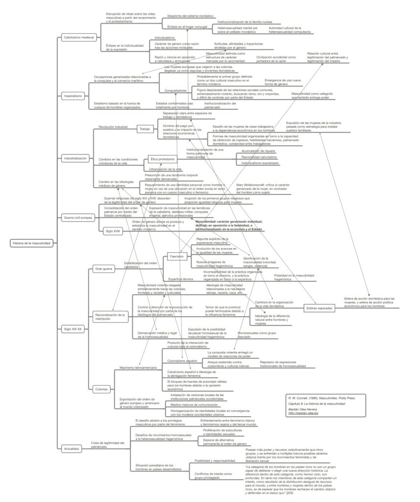

Resumen del capítulo 8 del libro Masculinidades, de R. W. Connell, que entrega una visión general de ciertos hitos históricos que configuran la masculinidad hegemónica occidental que conocemos.

_R. W. Connell. (1995). Masculinities. Polity Press_

Clic en el mapa conceptual o en [este link para acceder al resumen.](http://bastian.olea.biz/wp-content/uploads/2023/01/Connell-Historia-de-la-masculinidad.pdf)

