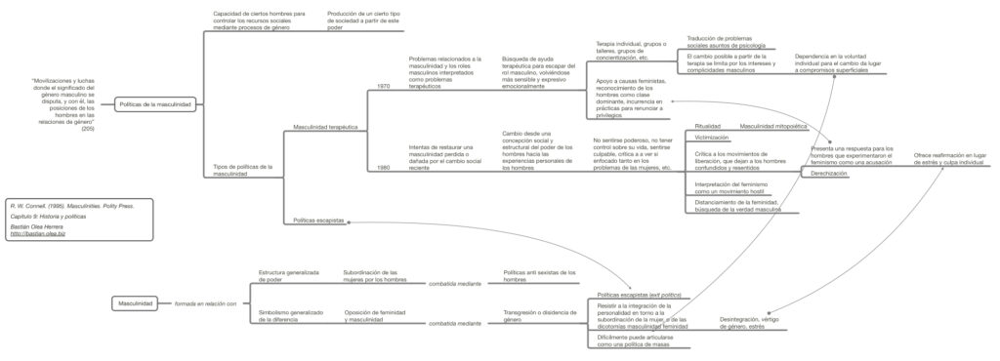

Resumen del capítulo 9 del libro Masculinidades, de R. W. Connell, donde se problematizar algunas formas de buscar la superación de la masculinidad hegemónica, sus beneficios y dificultades, así como los desvíos reaccionarios en torno a la relación de las masculinidades críticas y el feminismo.

_R. W. Connell. (1995). Masculinities. Polity Press_

Clic en el mapa conceptual o en [este link para acceder al resumen.](http://bastian.olea.biz/wp-content/uploads/2023/01/Connell-Politicas-de-la-masculinidad.pdf)

