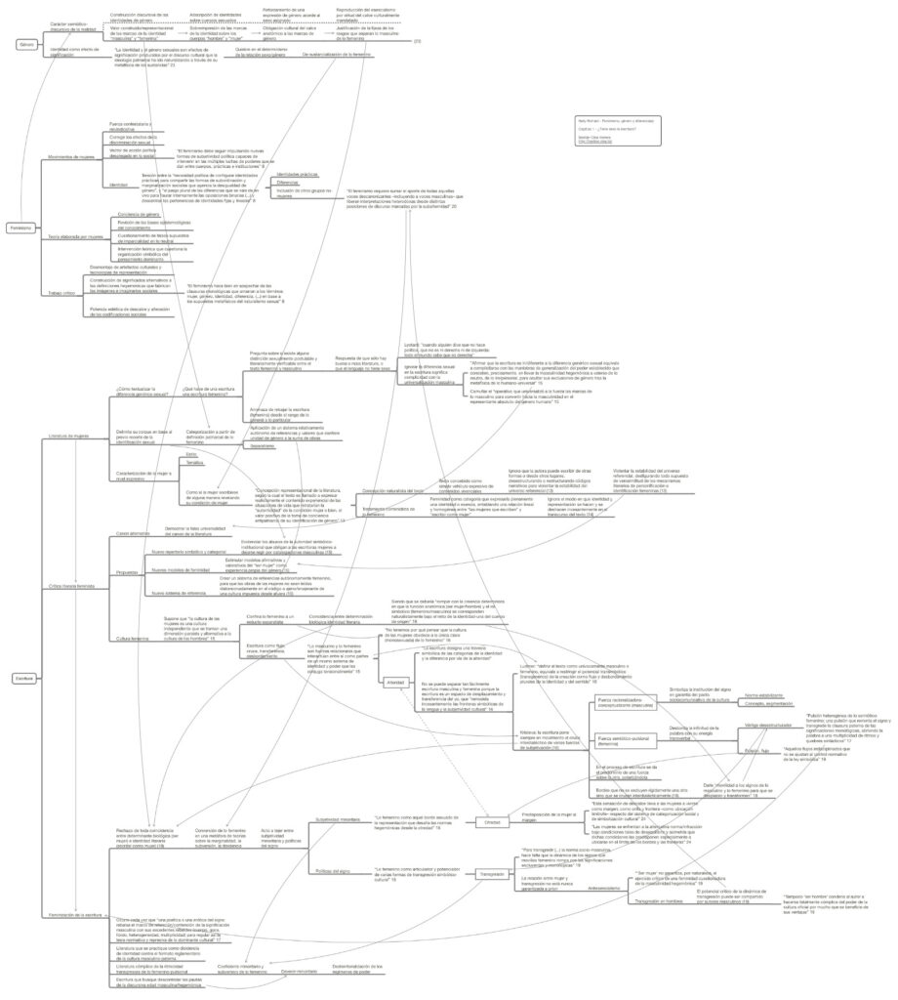

Resumen del capítulo 1, “¿Tiene sexo la escritura?”, del libro de Nelly Richard, _Feminismo, género y diferencia(s)._ Excelente texto que a crítica distintas concepciones de lo que es considerado “escritura femenina”, tanto desde perspectiva hegemónica/patriarcal como desde un feminismo esencialista, para posteriormente desarrollar una teoría de una _feminización de la escritura_ que no esté anclada en las categorías biológicas de sus autores, sino en la capacidad semiótica de transgresión, flujo y desestructuración de aquellos textos que buscan desafiar las normas sociales mediante lógicas distintas a las del universalismo masculino.

En la parte superior del mapa conceptual hay un conveniente esquema de dos pistas que describe el proceso de naturalización del género mediante su imposición cultural, y posteriormente su reproducción.

El segundo nodo del mapa conceptual presenta tres formas en las que Nelly Richard define al feminismo: feminismo como movimiento de mujeres, feminismo como teoría feminista, y feminismo como crítica feminista.

[Clic aquí o en la imagen para acceder al mapa conceptual de resumen.](http://bastian.olea.biz/wp-content/uploads/2023/02/Nelly-Richard-Feminismo-genero-y-diferencia.pdf)

