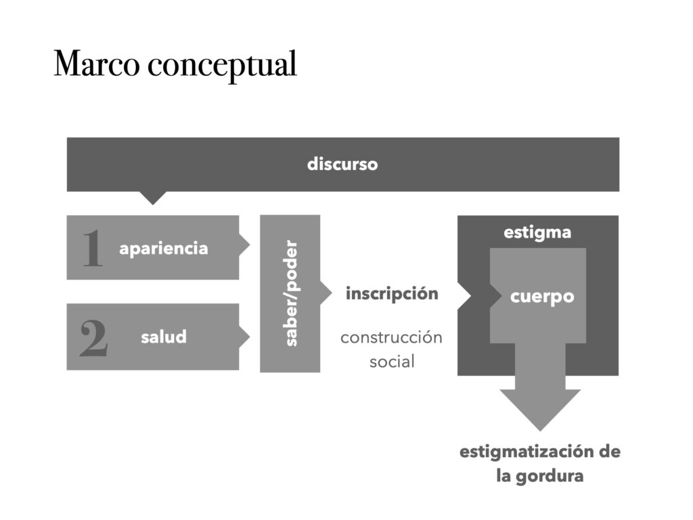
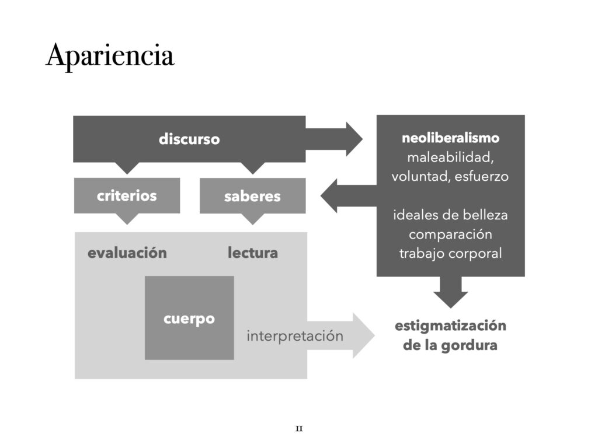
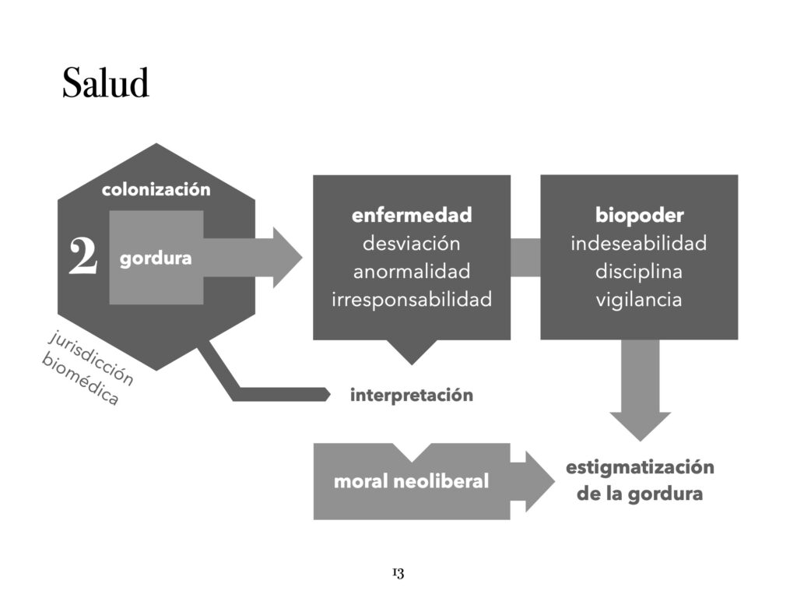
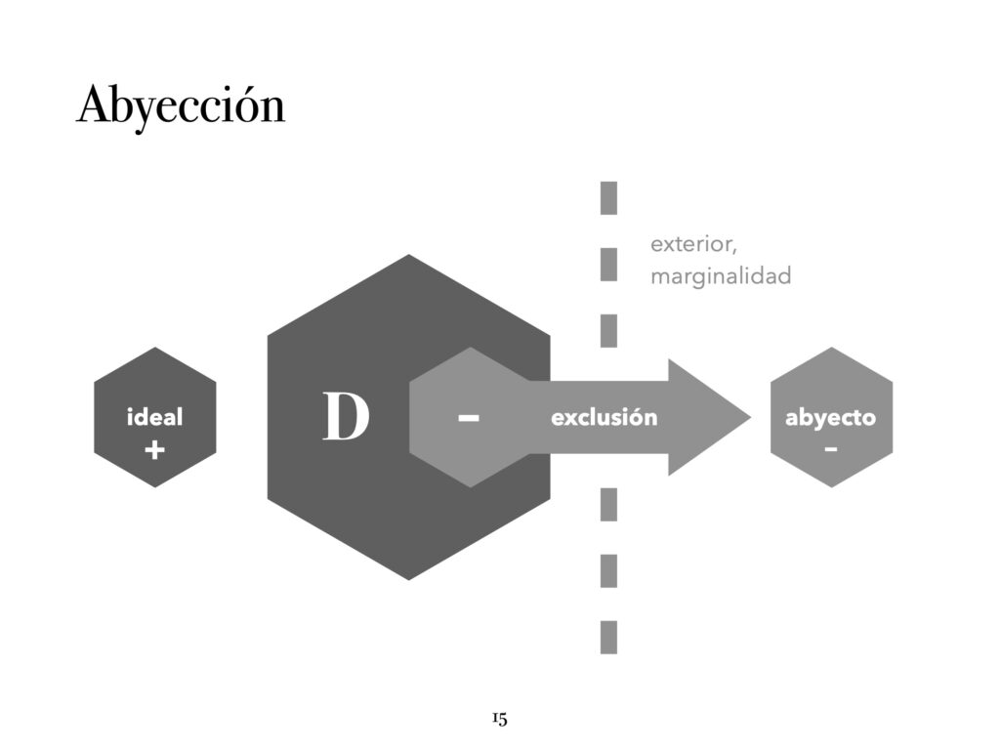

> Esta es la presentación de diapositivas que usé para defender mi tesis de magíster acerca de los procesos que explican la gordofobia, o el fenómeno de discriminación de las personas gordas.

- Leer/descargar en [Scribd](https://es.scribd.com/document/705939074/Defensa-de-tesis-Elementos-teoricos-y-conceptuales-en-torno-a-la-estigmatizacion-social-de-las-corporalidades-gordas)

- Leer/descargar en [Academia.edu](https://www.academia.edu/114944107/Defensa_de_tesis_Elementos_teóricos_y_conceptuales_en_torno_a_la_estigmatización_social_de_las_corporalidades_gordas)

- Leer/descargar en ResearchGate

\[scribd id=705939074 key=key-vJ5MqenLwvNObmHTrO6M mode=scroll\]

