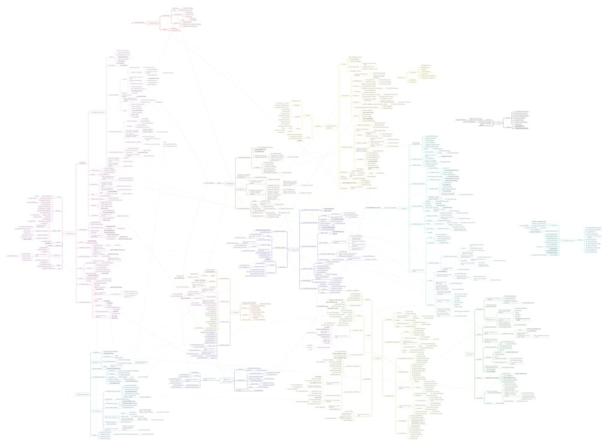

Éste es el mapa conceptual que usé para ir organizando la bibliografía recopilada para el desarrollo de mi tesis de magíster, titulada ["_Elementos teóricos y conceptuales en torno a la estigmatización social de las corporalidades gordas. Un análisis desde las dimensiones de la salud y la apariencia"_.](https://bastian.olea.biz/elementos-teoricos-y-conceptuales-en-torno-a-la-estigmatizacion-social-de-las-corporalidades-gordas-un-analisis-desde-las-dimensiones-de-la-salud-y-la-apariencia/)

Cada nodo representa un texto, agrupado por temática general (color) y sub-temáticas (los sub nodos y ramas del árbol).

Clic en la imagen para [acceder al mapa conceptual en PDF.](http://bastian.olea.biz/wp-content/uploads/2024/11/Bibliografia-por-temas.pdf)

