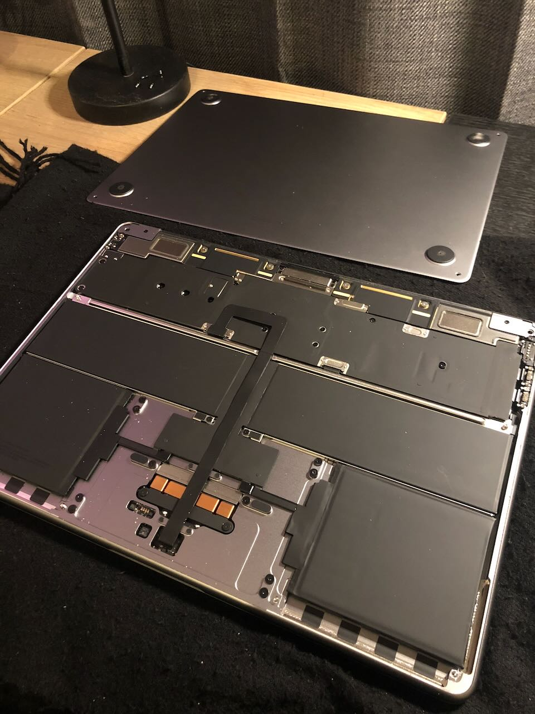
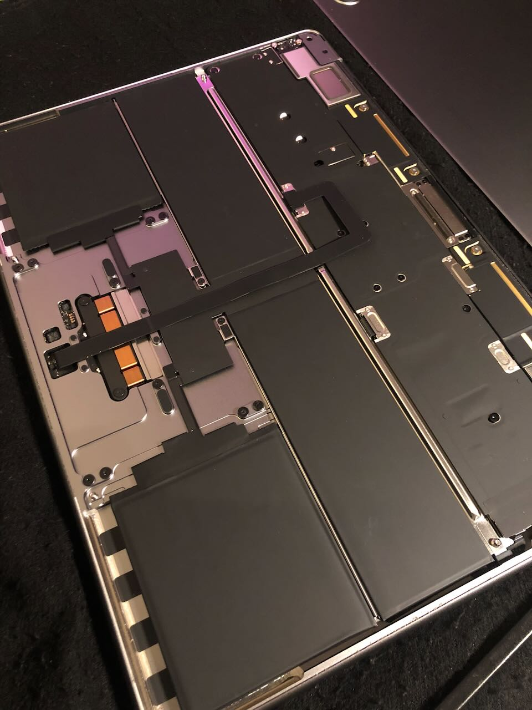
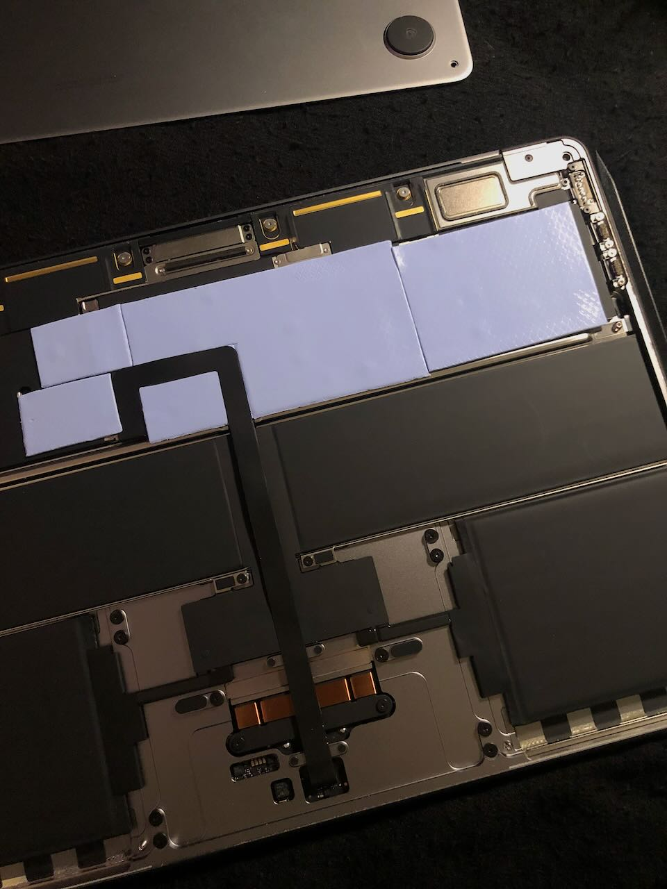

Le instalé un pad termal dentro a mi MacBook Air M3 para prevenir _throttling_ por temperatura. La función del pad es ayudar a que el calor del procesador se disipe más rápido por medio del cuerpo metálico del computador, al adherir material con mayor conducción térmica en un espacio que originalmente está vacío.

Compré el _Thermal Pad Arctic Tp-3 100x100mm_ de 1.0mm de grosor.

:::{.galeria}
{.fotito}
{.fotito}
{.fotito}
:::