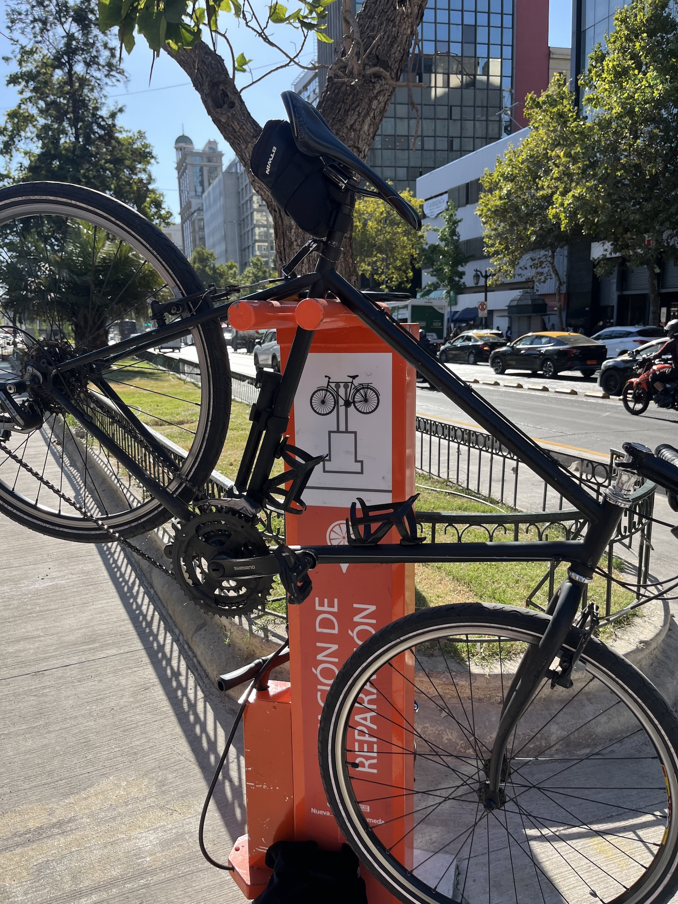
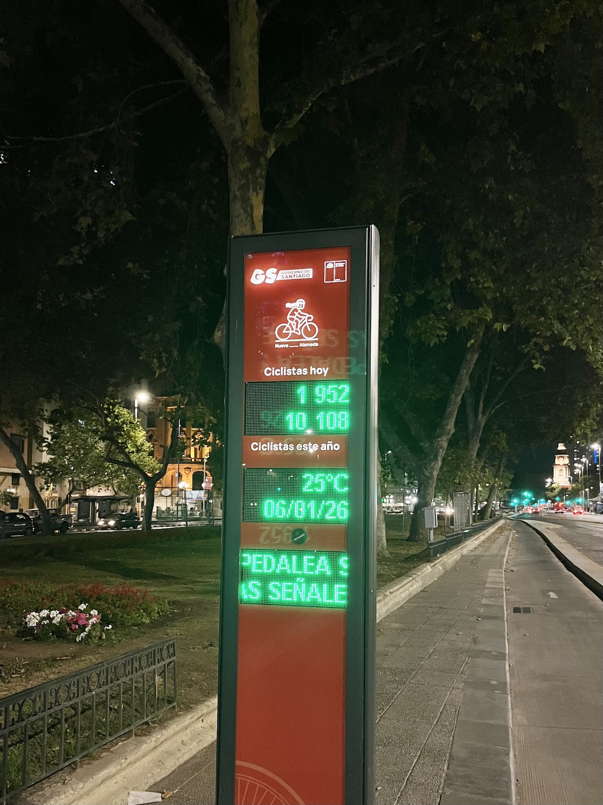

{.foto}

{.foto}

::: {.twitter .centrar}
<blockquote class="twitter-tweet">
Martes a las 10 de la noche y ya han pasado casi 2.000 ciclistas por la ciclovía de la Alameda. Para los que dicen que esta infraestructura está de más 🚲 <a href="https://t.co/C1UTZS19In">pic.twitter.com/C1UTZS19In</a>
&mdash; Bastián Olea 🌸 (@bastimapache) <a href="https://twitter.com/bastimapache/status/2008711597116846121?ref_src=twsrc%5Etfw">January 7, 2026</a></blockquote> 
:::