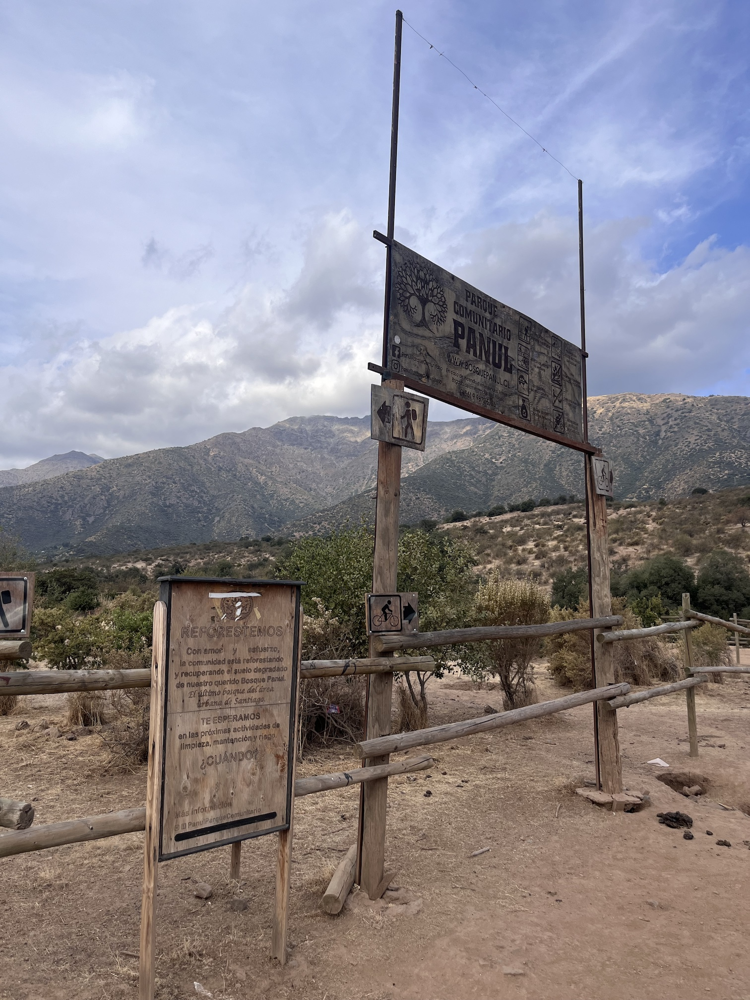
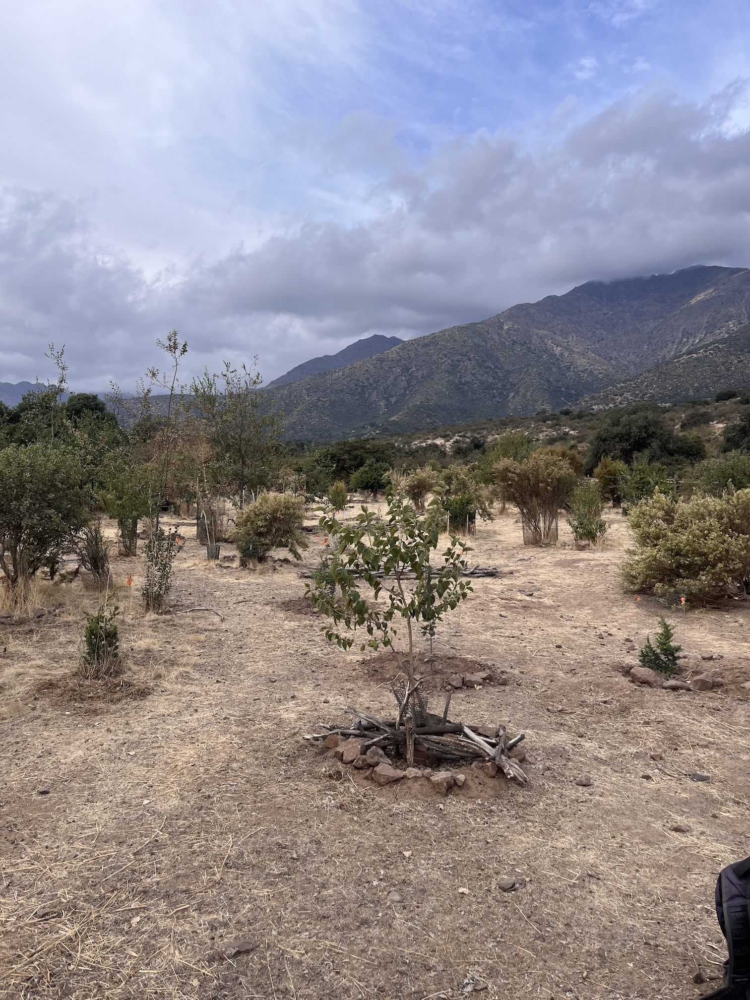
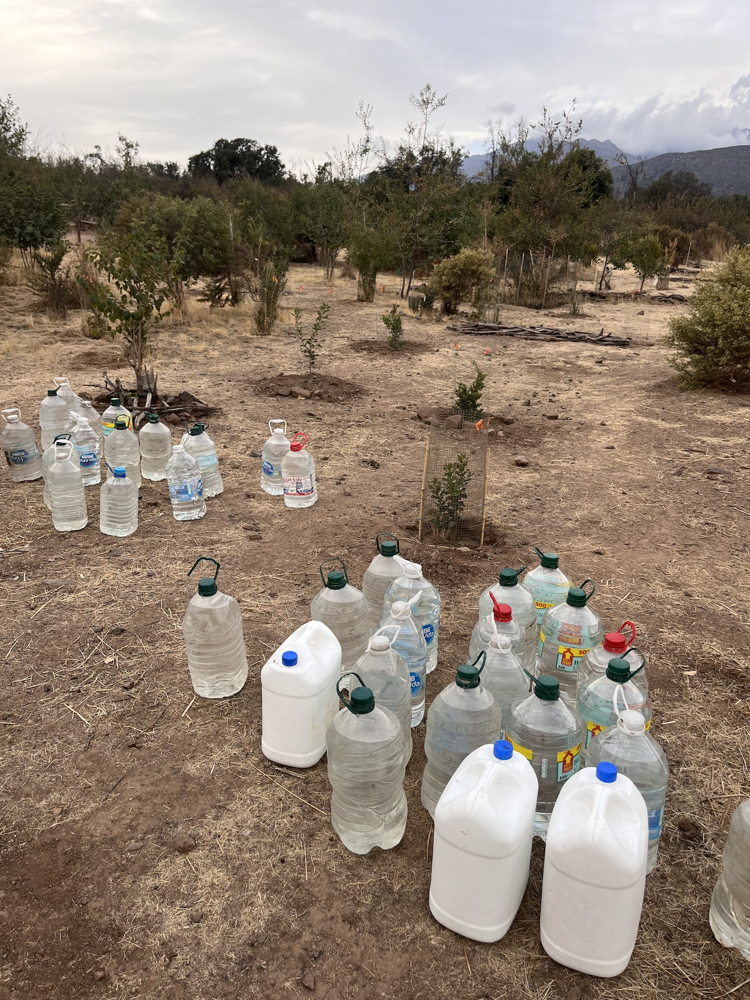
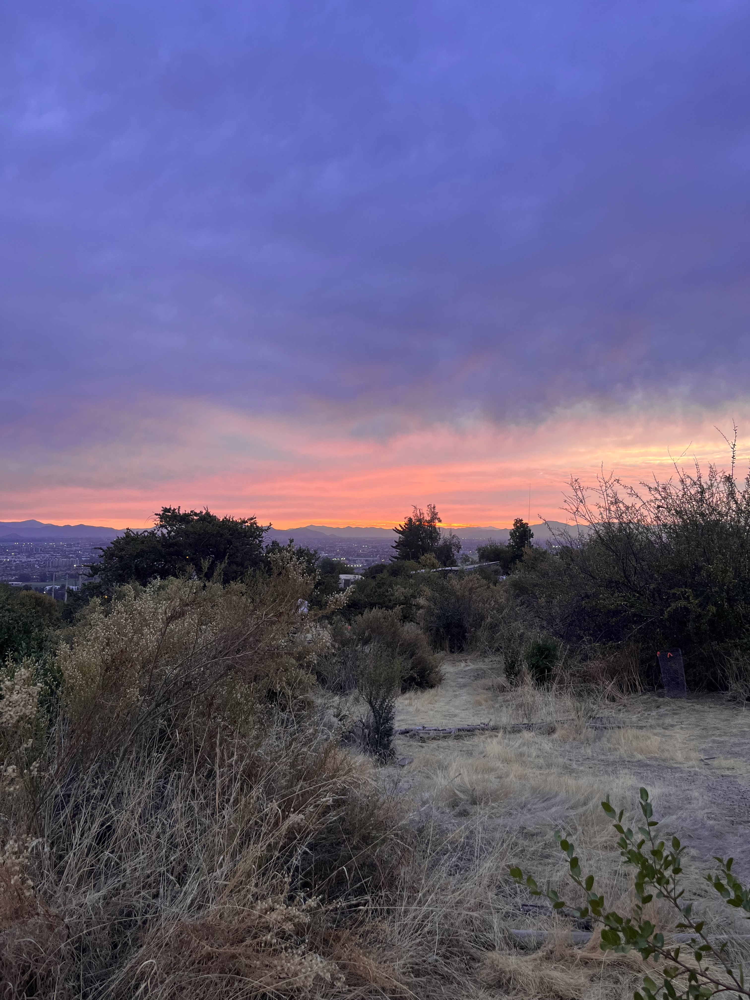
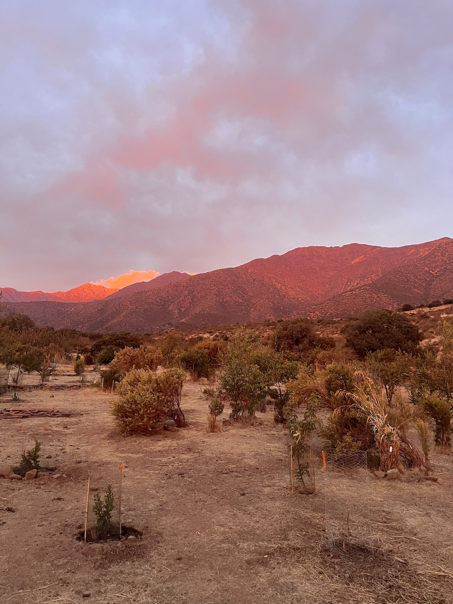
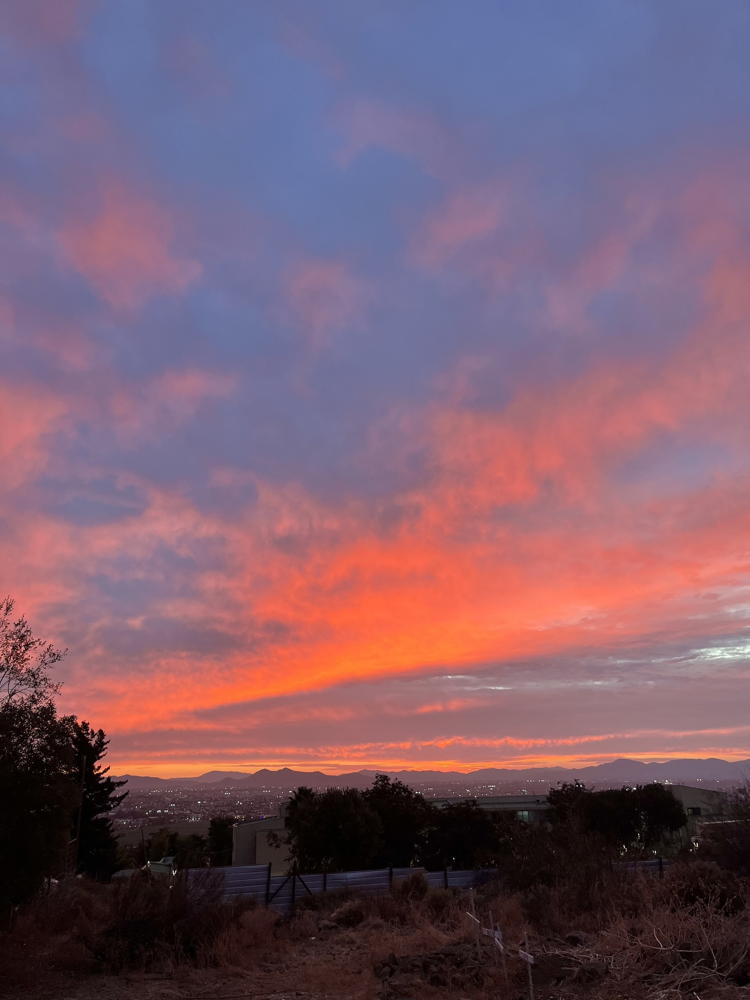

El Panul es el **último bosque nativo** en Santiago, ubicado en la precordillera de la comuna de La Florida. Es un bosque de tipo esclerófilo, por lo que está adaptado al clima cálido y seco de la zona.

:::: {.centrar}
::: {.openstreetmap}
<iframe width="380" height="300" src="https://www.openstreetmap.org/export/embed.html?bbox=-70.53850293159486%2C-33.53799651157129%2C-70.5307459831238%2C-33.531852661587585&amp;layer=hot&amp;marker=-33.53492464115856%2C-70.53462445735931" style="border: 1px solid black"></iframe>
:::
::::

En los últimos años el bosque sido frecuentado cada vez más por la ciudadanía, particularmente desde que ha sido difundido como un **parque comunitario**. Si bien es bueno que más personas puedan conectar con la naturaleza, la popularidad tiene efectos negativos en el bosque, principalmente por la **erosión de los suelos** y el **daño a la biodiversidad**. Las bicicletas de montaña, las motos y las personas que caminan fuera de los senderos habilitados también erosionan el terreno, obstruyendo la regeneración de la vida en el bosque.

:::: {.galeria}
{.fotito .lightbox group="panul"}
{.fotito .lightbox group="panul"}
{.fotito .lightbox group="panul"}
{.fotito .lightbox group="panul"}
{.fotito .lightbox group="panul"}
{.fotito .lightbox group="panul"}
::::

Luego de una invitación abierta de la organización [Panul Parque Comunitario](https://www.instagram.com/panulparquecomunitario/), asistí a una **jornada de riego** del sector de reforestación del bosque. Este sector se encuentra en la entrada del bosque (por la calle Las Tinajas, que es una continuación de Rojas Magallanes), sector más afectado por el tránsito de personas al punto de transformar el terreno en terra compacta y carente de vida.

La actividad estaba calendarizada con precisión para favorecer con el riego a las especies existentes. Las plantas de la reforestación estaban cercadas con alambre para evitar que se dañen, y también estaban marcadas según la fecha del último riego, lo que demuestra un alto nivel de planificación para el cuidado del bosque.

:::: {.centrar}
::: {.tiktok}
<iframe src="https://www.tiktok.com/embed/v2/7620589848604593428" height="740" width="400"></iframe>
:::
::::

Se llenaron más de 100 botellas con agua en la sede de la [brigada forestal de La Florida](https://beaf.cl), que fueron subidas con auto a la entrada del bosque. Trasladamos las botellas y distribuimos más de **600 litros de agua** entre las plantas que les correspondía riego.

Conocí personas muy bonitas, con distintos lazos al bosque. Personalmente tengo una conexión con el Panul desde la infancia, cuando venía en bicicleta a explorar bajo sus árboles. Luego de la actividad vimos la puesta de sol con el grupo de voluntari@s y conversamos sobre la situación del bosque.

Sigue las [redes sociales](https://www.instagram.com/panulparquecomunitario/) del bosque para enterarte de las próximas actividades de voluntariado, y si puedes, ¡asiste y cuida el bosque!

:::: {.boton style="width: 400px;"}
[ Instagram Panul Parque Comunitario](https://www.instagram.com/panulparquecomunitario/)
::::

:::: {.boton style="width: 400px;"}
[ Sitio web Panul Para Todos](https://www.panulparatodos.cl)
::::

Si visitas el Panul, recuerda:

- Usa los senderos delimitados
- Lleva una bolsa para llevarte tu basura
- Recoge la basura que encuentres durante tu descenso
- Si te sobra agua, úsala para regar una planta
- No lleves parlantes
- No prendas fuego