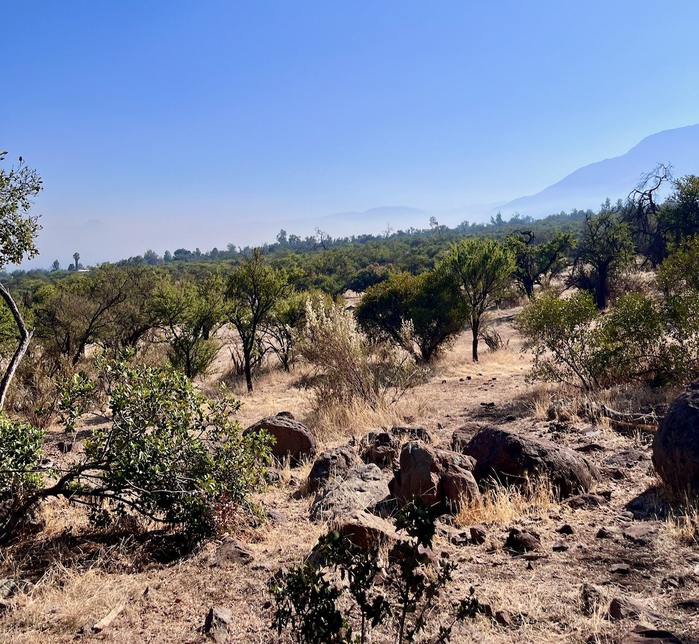
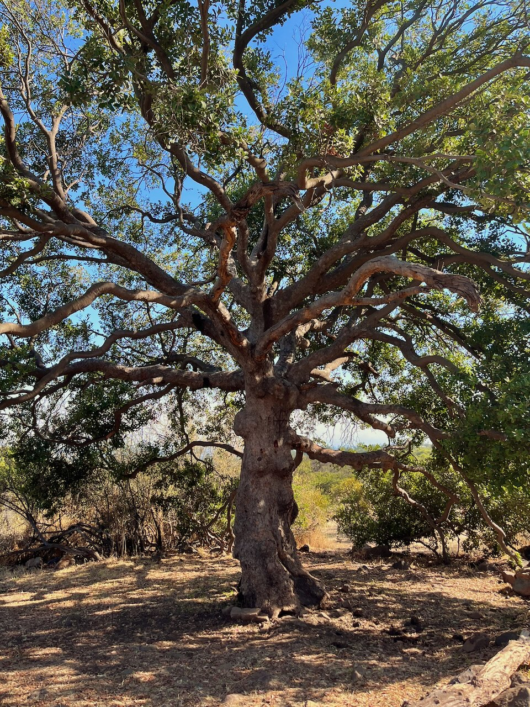

El sábado nos organizamos entre personas de la **Red comunitaria de cuidado del Panul** para una jornada de limpieza del bosque. Fuimos con bolsas de basura y guantes, y dimos una vuelta por el bosque recogiendo toda basura que encontramos, también pasando por unos puntos de basura concentrada.

::: {.centrar}
{.foto}
:::

Afortunadamente el bosque no estaba tan sucio como otras veces, pero siempre es importante poder eliminar todo rastro humano que peuda perturbar el ecosistema.

En la ruta aprovechamos de visitar algunos puntos del bosque, como el **árbol de la Machi.**

::: {.centrar}
{.foto .lightbox}
:::

Durante esta época del año (finales del verano) florecen muchas **Añañucas**, flores endémicas de Chile, en preciosas tonalidades rosadas, amarillas, rojizas y coral.

::: {.galeria}
{.fotito .lightbox group="Añañucas"}
{.fotito .lightbox group="Añañucas"}
{.fotito .lightbox group="Añañucas"}
{.fotito .lightbox group="Añañucas"}
{.fotito .lightbox group="Añañucas"}
{.fotito .lightbox group="Añañucas"}
{.fotito .lightbox group="Añañucas"}
:::

:::: {.boton style="width: 400px;"}
[ Instagram Panul Parque Comunitario](https://www.instagram.com/panulparquecomunitario/)
::::

:::: {.centrar}
::: {.tiktok}
<iframe src="https://www.tiktok.com/embed/v2/7622730022054268181" height="740" width="400"></iframe>
:::
::::