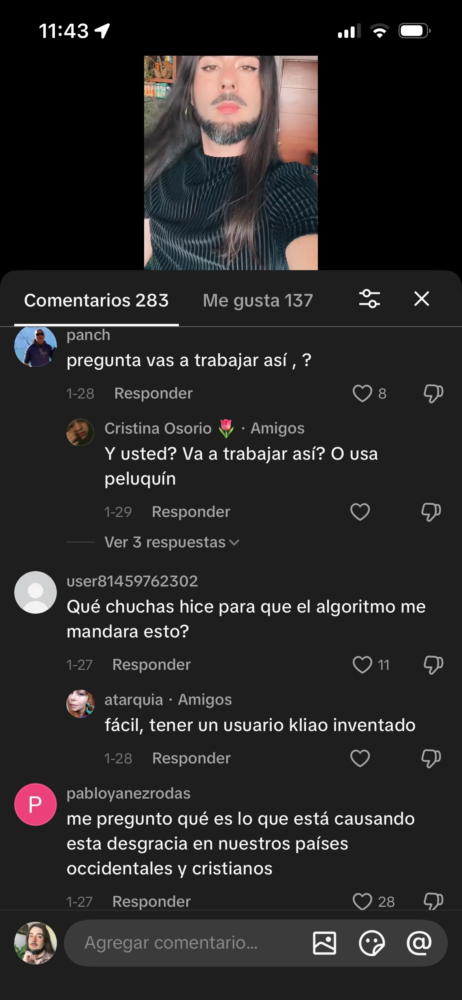
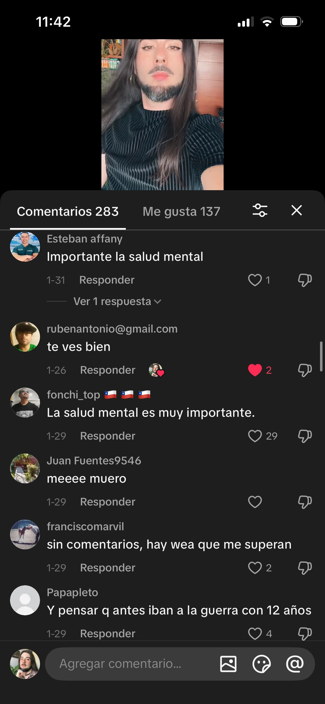
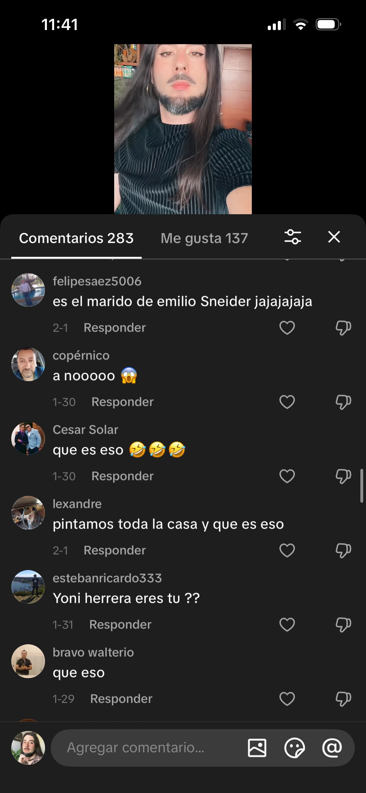
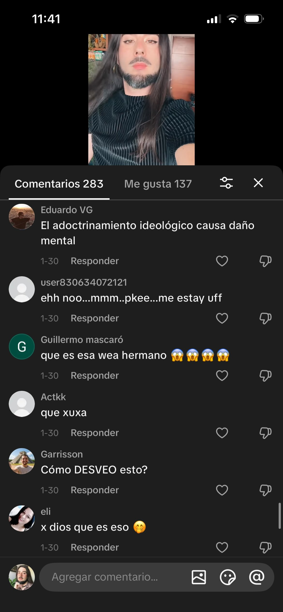
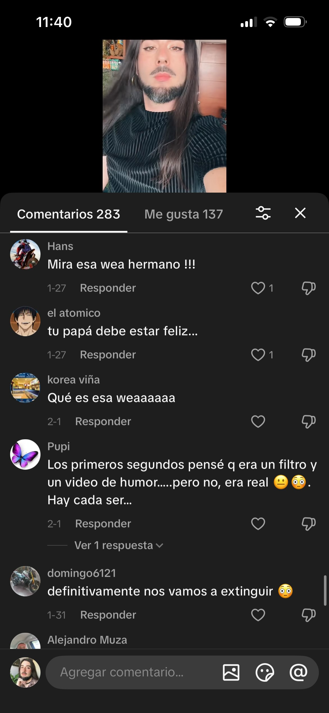
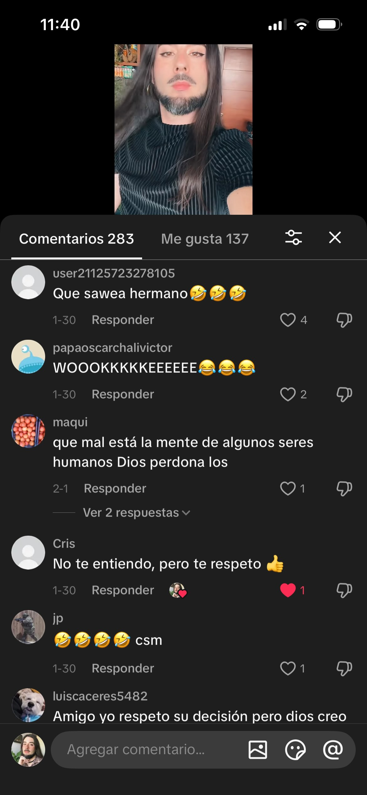
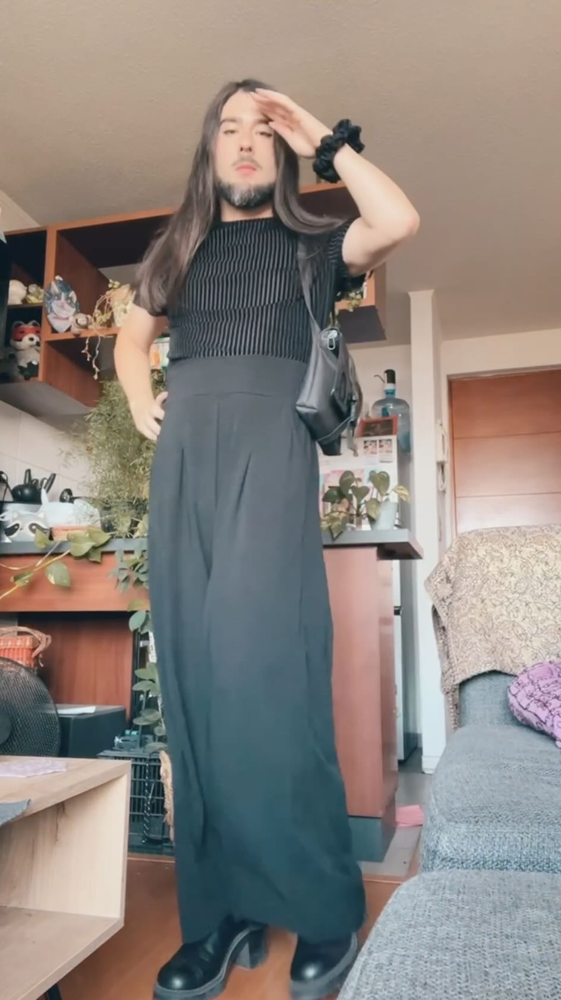
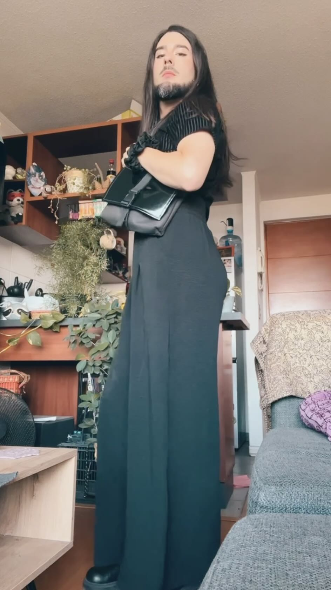
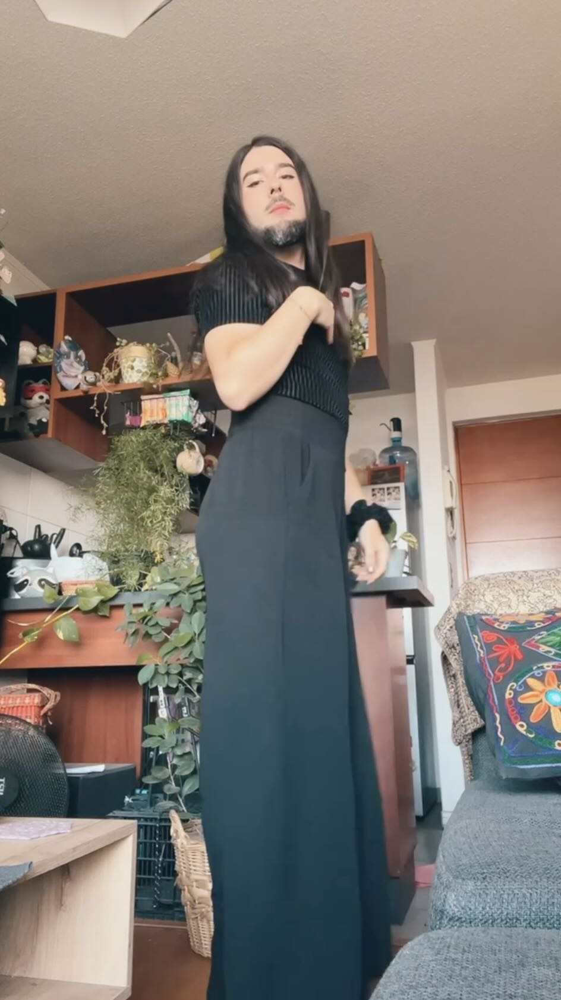

A veces el algoritmo de TikTok les da muchas visitas a videos equis. Me pasó con uno mostrando un outfit que llegó a 25 mil visitas, y por consiguiente se llenó de **cientos de comentarios de odio.** 

:::: {.centrar}
::: {.tiktok}
<iframe src="https://www.tiktok.com/embed/v2/7599152591737539851" height="740" width="400"></iframe>
:::
::::

Se llenó de gente burlándose de mi apariencia, haciendo bromas de mi género, y lamentándose por el estado de la humanidad. Como si pintarse un poco y ponerse ropa escasamente femenina fuera algo terrible.

:::: {.galeria}
{.fotito .lightbox group="tiktok"}
{.fotito .lightbox group="tiktok"}
{.fotito .lightbox group="tiktok"}
{.fotito .lightbox group="tiktok"}
{.fotito .lightbox group="tiktok"}
{.fotito .lightbox group="tiktok"}
::::

Ya me había pasado antes en todo caso. Me pasa siempre que algo que digo llega al lado incorrecto de internet y la gente se burla por mi foto de perfil o cualquier indicio de feminidad. Por lo menos salieron amiguitas mías a defenderme 🩷

El outfit en cuestión:

:::: {.galeria}
{.fotito .lightbox group="outfit"}
{.fotito .lightbox group="outfit"}
{.fotito .lightbox group="outfit"}
::::

Lo único bueno de la situación fue exponer a 25 mil personas a el medio tema de **Bosse-de-Nage**:

:::: {.centrar}
::: {.playlist}
<iframe allow="autoplay *; encrypted-media *;" frameborder="0" height="150" style="width:100%;overflow:hidden;background:transparent;" sandbox="allow-forms allow-popups allow-same-origin allow-scripts allow-storage-access-by-user-activation allow-top-navigation-by-user-activation" src="https://embed.music.apple.com/cl/album/why-am-i-so-lovely-because-my-master-washes-me/666127411?i=666127466"></iframe>
:::
::::