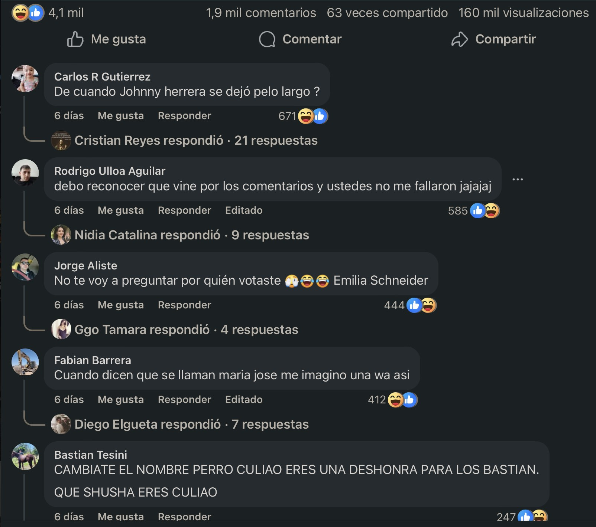
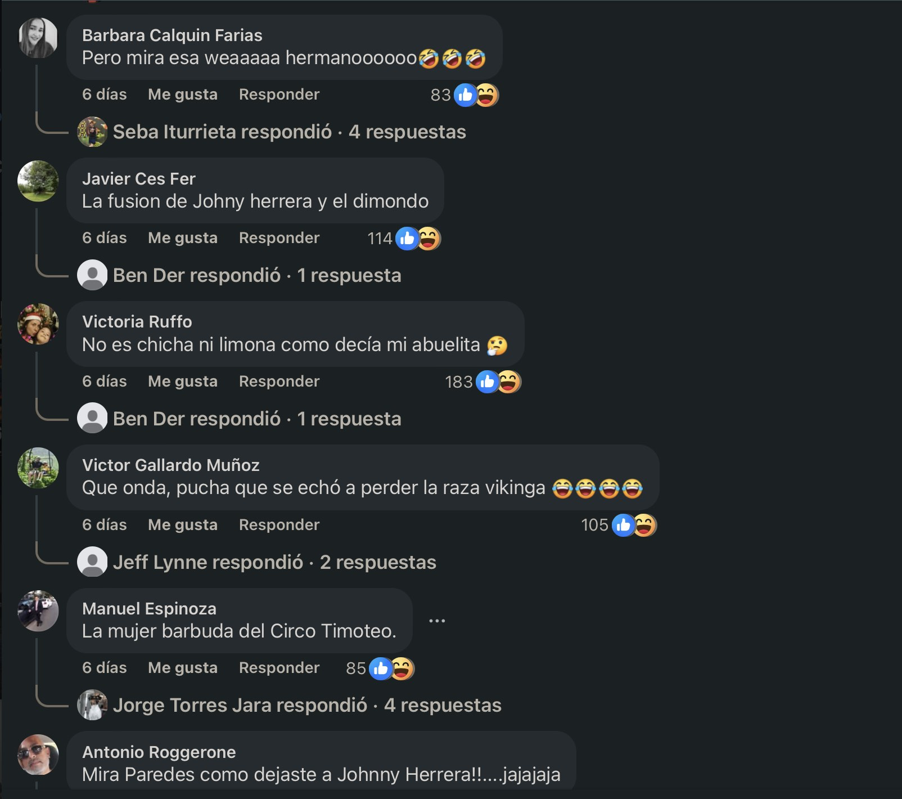
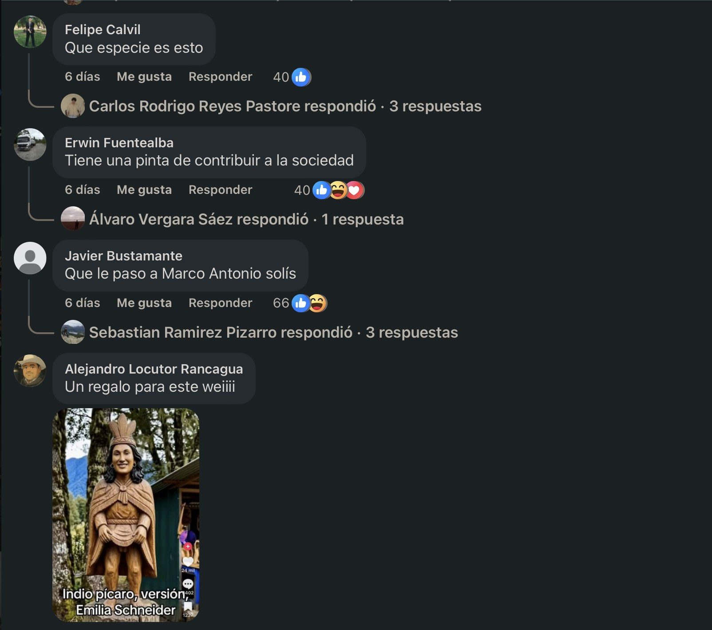
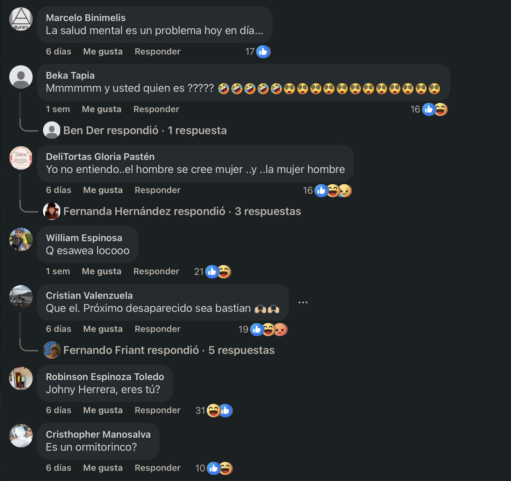
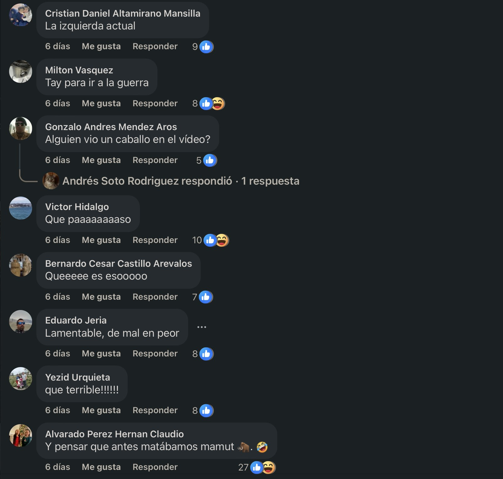
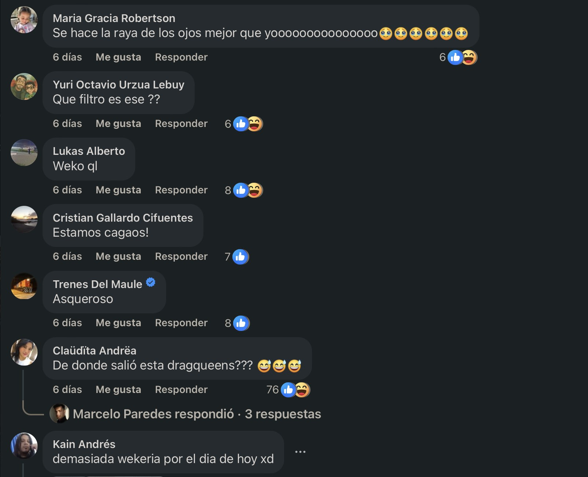
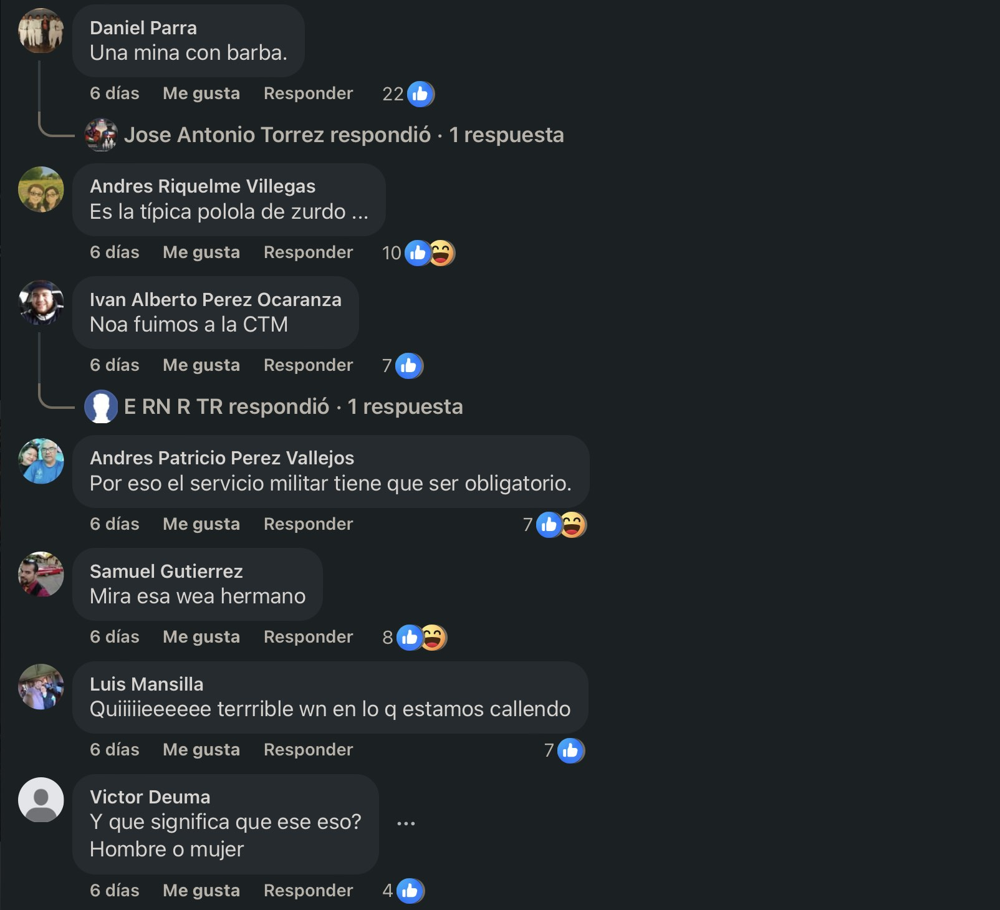
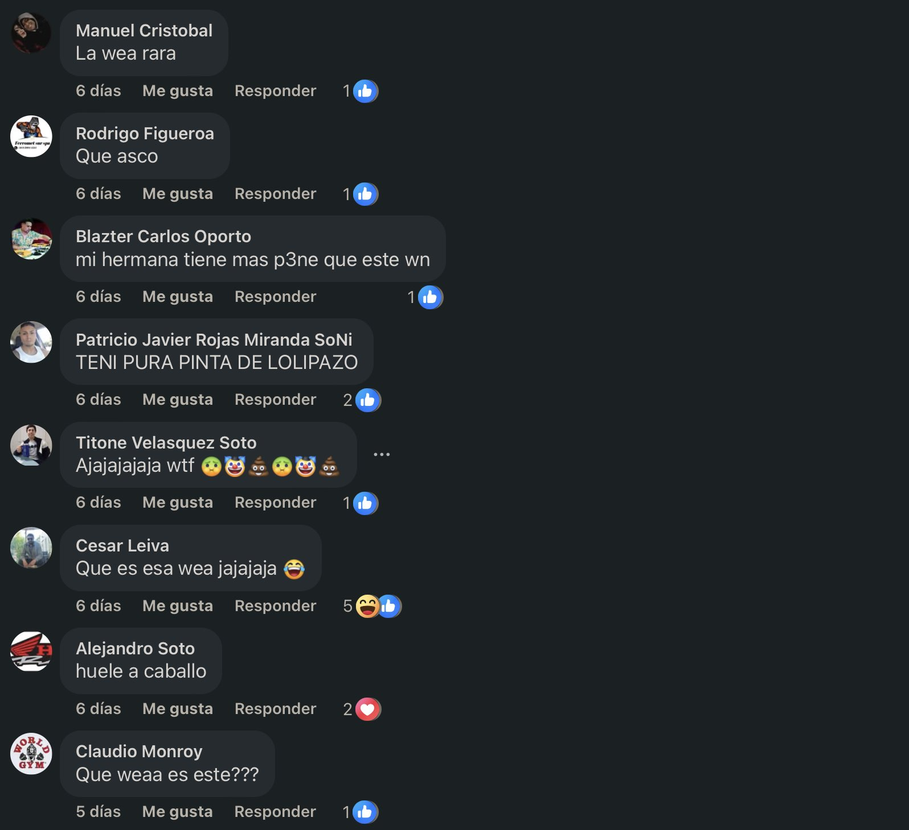

El fin de semana visité [3 y 4 Álamos](/posts/2026-05-31/), y la gente de la organización grabó videos de las opiniones de sus visitantes. Me pidieron la opinión y yo hablé no más. Acto seguido: 1.900 comentarios en el [video mío que subieron a Facebook](https://www.facebook.com/reel/1310650607229374/?t=0), 99% personas burlándose de mi identidad de género.

Nunca uso Facebook así que solo me enteré cuando una persona de la organización, muy considerada, me habló para darme su apoyo.

:::: {.galeria}
{.fotito .lightbox group="facebook"}
{.fotito .lightbox group="facebook"}
{.fotito .lightbox group="facebook"}
{.fotito .lightbox group="facebook"}
{.fotito .lightbox group="facebook"}
{.fotito .lightbox group="facebook"}
{.fotito .lightbox group="facebook"}
{.fotito .lightbox group="facebook"}
::::

El comentario que más me dejó pa dentro fue _"que el próximo desaparecido sea Bastián"_ ¿Qué tan inhumano se tiene que llegar a ser para siquiera pensar algo como eso?

:::: {.centrar}
::: {.tiktok}
<iframe src="https://www.facebook.com/plugins/video.php?height=476&href=https%3A%2F%2Fwww.facebook.com%2Freel%2F1310650607229374%2F&show_text=true&width=267&t=0" width="267" height="591" style="border:none;overflow:hidden" scrolling="no" frameborder="0" allowfullscreen="true" allow="autoplay; clipboard-write; encrypted-media; picture-in-picture; web-share" allowFullScreen="true"></iframe>
:::
::::

Subo estas weás solamente para visibilizar el acoso a personas LGBTIQ+. ¿Por qué hay que soportar que te humillen solamente por existir?