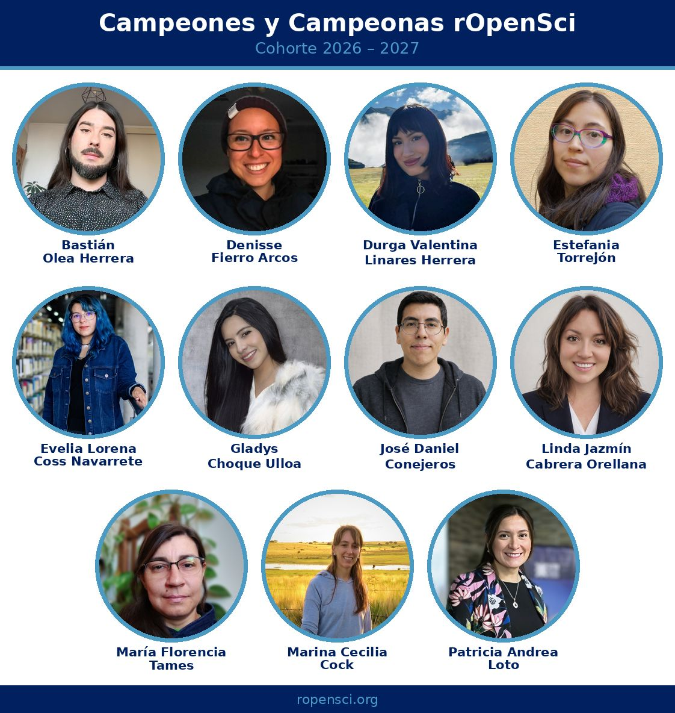

Estoy muy feliz de ser parte de esta cohorte del [programa de Campeonas/es de rOpenSci](https://ropensci.org/es/blog/2026/06/09/champions-2026/)! 

::: {.foto .centrar}

:::

Entre todas las cosas que hace [rOpenSci](https://ropensci.org/es/) por el ecosistema del código abierto y la investigación, la versión 2026 de este programa guía a personas de distintas disciplinas y países latinoamericanos a desarrollar software abierto para enfrentar problemas reales.

Llevamos varias clases y he aprendido muchísimo! Agradezco demasiado instancias como ésta que entregan el conocimiento y el tejido humano para que el software libre florezca 🌺

- [Paquetes desarrollados por el equipo y comunidad de rOpenSci](https://ropensci.org/es/packages/)

 

:::: {.centrar}
<iframe src="https://www.linkedin.com/embed/feed/update/urn:li:share:7470472604429156352?collapsed=1" height="667" width="504" frameborder="0" allowfullscreen="" title="Publicación integrada"></iframe>
::::