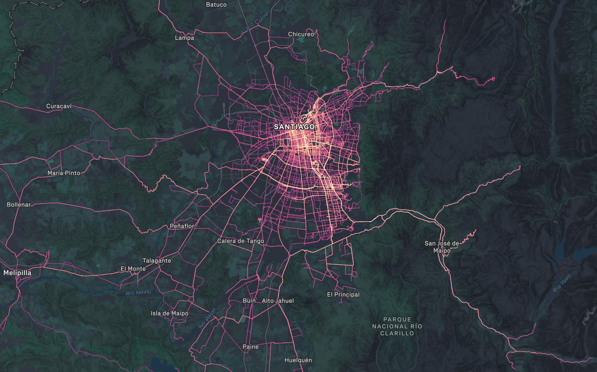

Uno de mis pasatiempos es recorrer lugares nuevos (para mi) de Santiago en bicicleta. Según el sitio web [wandrer.earth](https://wandrer.earth), voy en el **1er lugar** de ciclistas que han recorrido más porcentaje de la superficie de la Región Metropolitana: **4552,3 kilómetros únicos**[^1] de un total de 25.229 kilómetros pedaleables; es decir, he recorrido un **18% de la Región Metropolitana de Santiago**.

[^1]: Kilómetros en calles nuevas, excluyendo calles repetidas

Puede sonar a poco, pero si lo vemos en un mapa de calor, es caleta:
  
::: {.foto .centrar}

:::

A nivel de Chile, he recorrido **5.867,4 kilómetros únicos**.

Aquí está la tabla de posiciones de la Región Metropolitana a la fecha (26 de junio 2026):

| N°| Atleta                   | Puntos | Porcentaje | Kilómetros | Progreso este año |
|---|--------------------------|--------|------------|------------|-------------------|
| 1 | **Bastián Olea Herrera** | 3388   | 18,044%    | 4552.3 km  | 141.1 km (0.55%) |
| 2 | **Pablocito Gonzalez**   | 2739   | 13,023%    | 3174.7 km  | 232.1 km (0.95%) |
| 3 | **Javier J**             | 2461   | 11,208%    | 2825.1 km  | 61.8 km (0.24%) |
| 4 | **Patrick Mac Kay**      | 869    | 3,864%     | 974.9 km   | 6.6 km (0.02%) |
| 5 | **Laura Möller**         | 846    | 5,134%     | 1295.4 km  | 0.0 km (0.0%) |
| 6 | **Tomas Gueneau de Mussy**|641    | 3,827%     | 965.2 km   | 50.9 km (0.2%) |
| 7 | **Alejandro López**      | 607    | 3,608%     | 910.5 km   | 0.0 km (0.0%) |
| 8 | **Alejandro Silva**      | 594    | 2,98%      | 751.8 km   | 0.0 km (0.0%) |
| 9 | **Igor Alarcon**         | 572    | 3,075%     | 775.1 km   | 72.1 km (0.28%) |
| 10 | **Diego Aviles**        | 503    | 3,209%     | 809.8 km   | 14.1 km (0.05%) |
  

