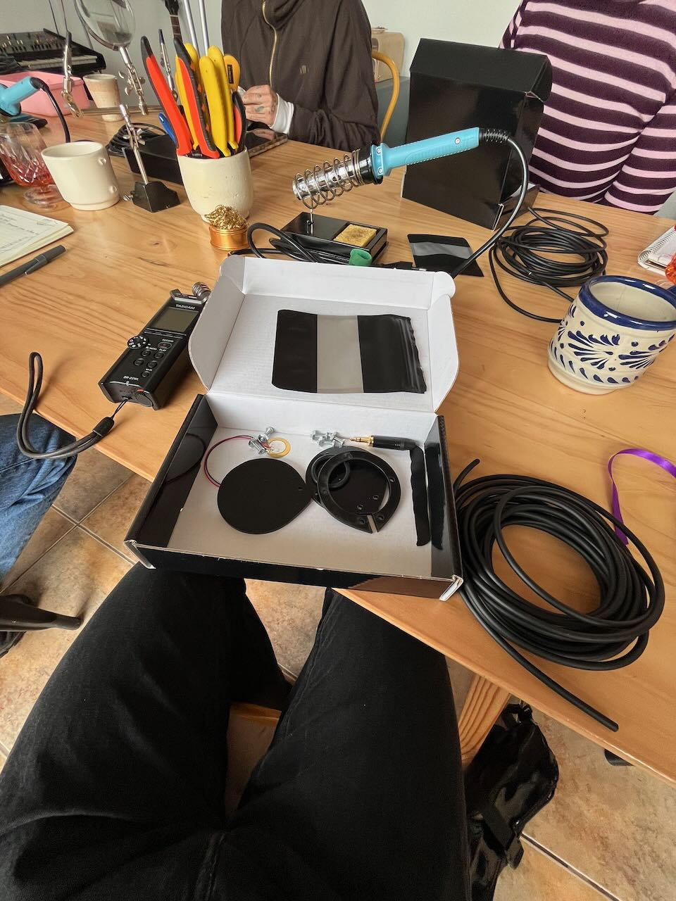
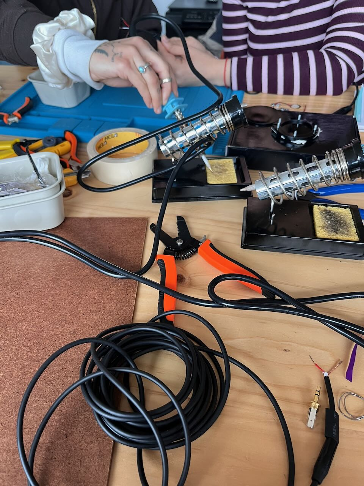
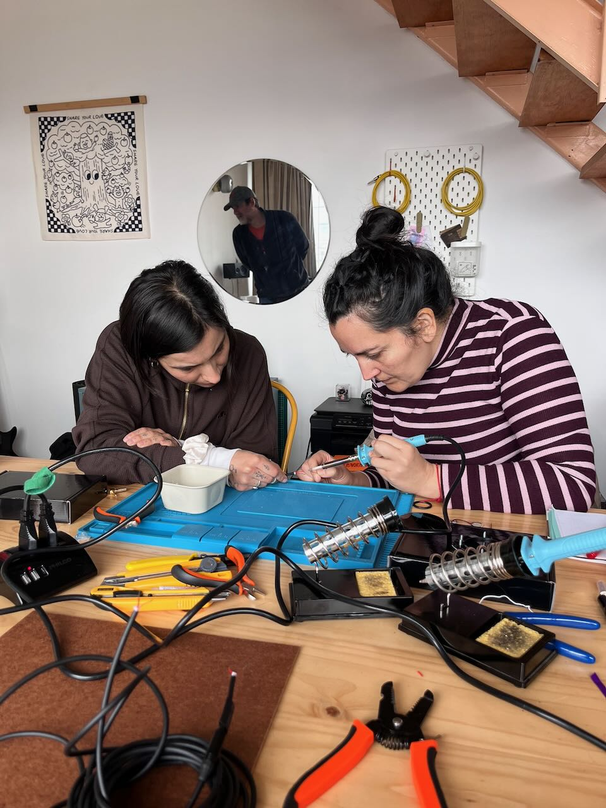
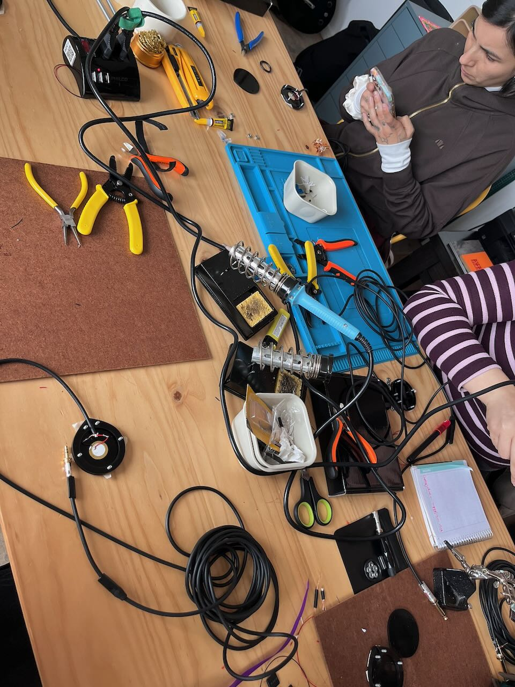
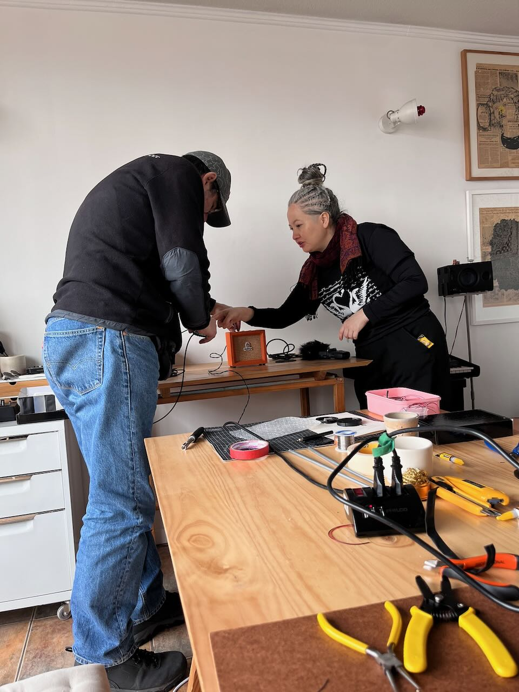
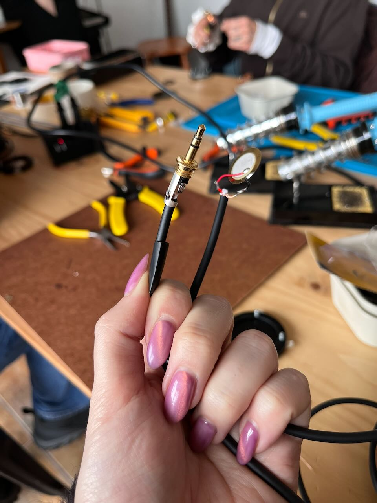
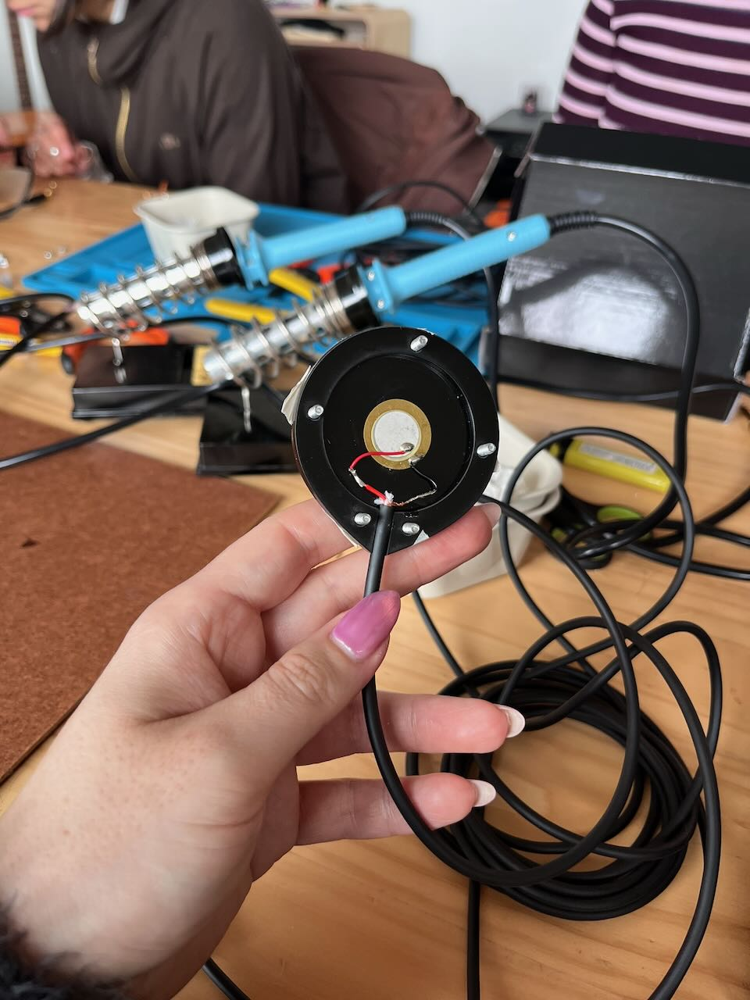
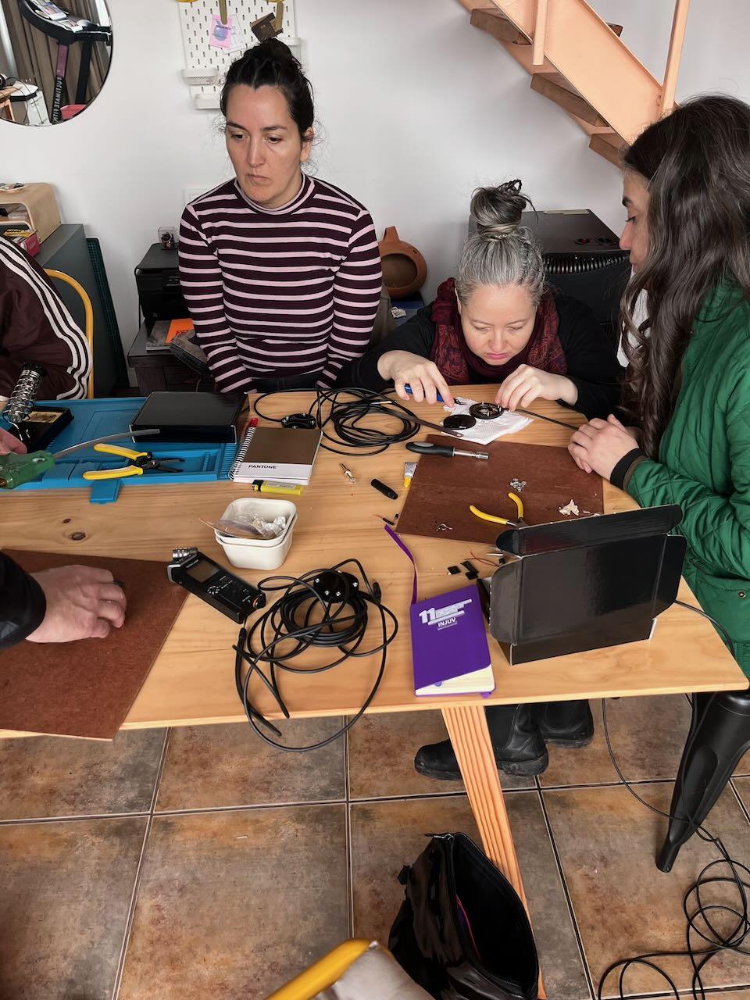
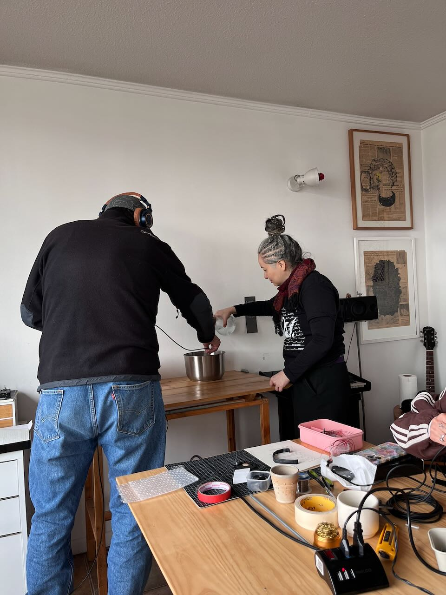
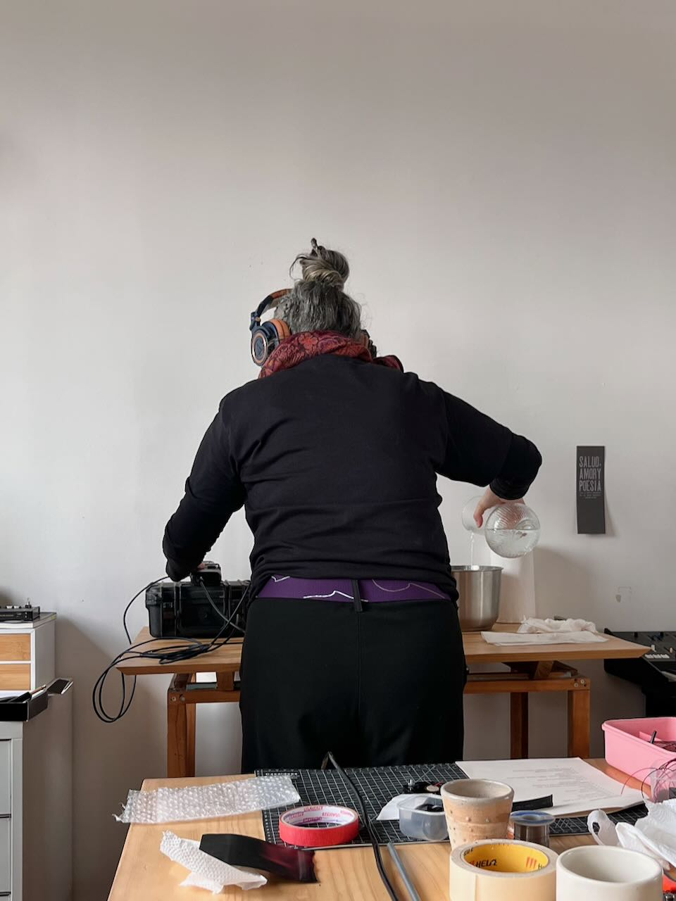

El sábado asistí al taller taller _Hidrofonías_ organizado por la artista transmedia [Camila Cijka](https://www.instagram.com/camilacijka), donde construimos desde cero un hidrófono: un micrófono para grabar sonidos del agua.

[Bowerbankii](https://www.instagram.com/bowerbankii) es un laboratorio de electrónica sonora y microfonía experimental. Nos dieron todos los materiales necesarios, así como las herramientas, explicándonos cada paso hasta lograr la manufactura del instrumento. Aprendí a usar bien un cautín para soldar! Al final pudimos probar los hidrófonos con grabadora y audífonos profesionales.

::: {.galeria}
{.fotito .lightbox}
{.fotito .lightbox}
{.fotito .lightbox}
{.fotito .lightbox}
{.fotito .lightbox}
{.fotito .lightbox}
{.fotito .lightbox}
{.fotito .lightbox}
{.fotito .lightbox}
{.fotito .lightbox}
:::

Hace muchos años había creado mi propio hidrófono usando una cajita metálica de crema de manos, y fui a grabar los sonidos del canal San Carlos, en La Florida, pero quería reforzar esos conocimientos y tener un hidrófono de buena calidad.