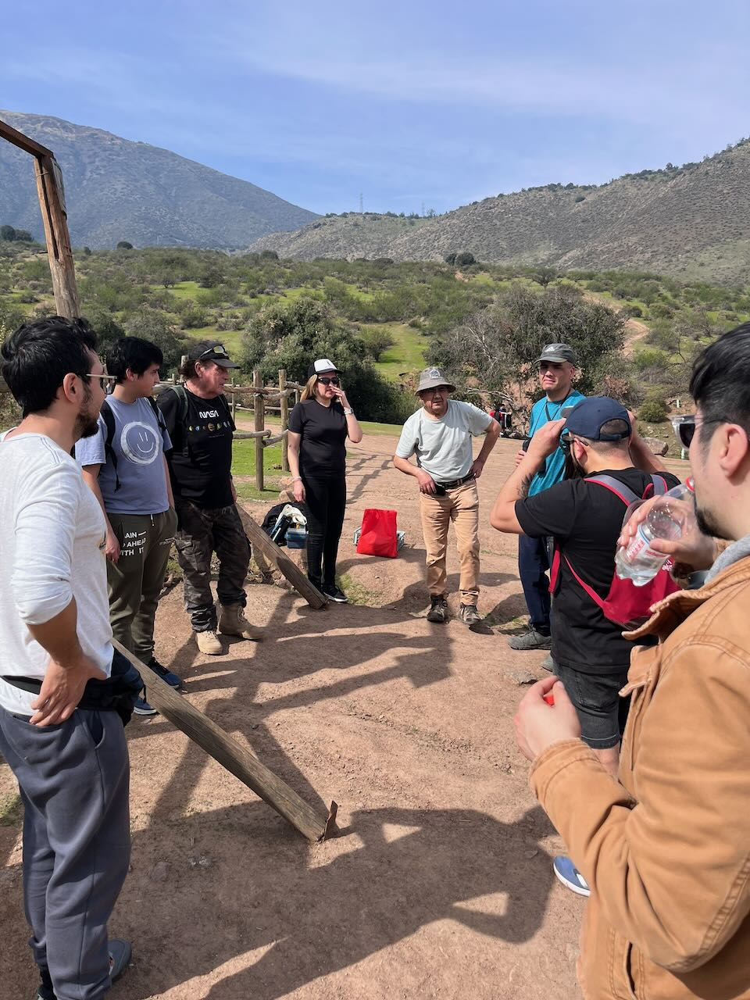
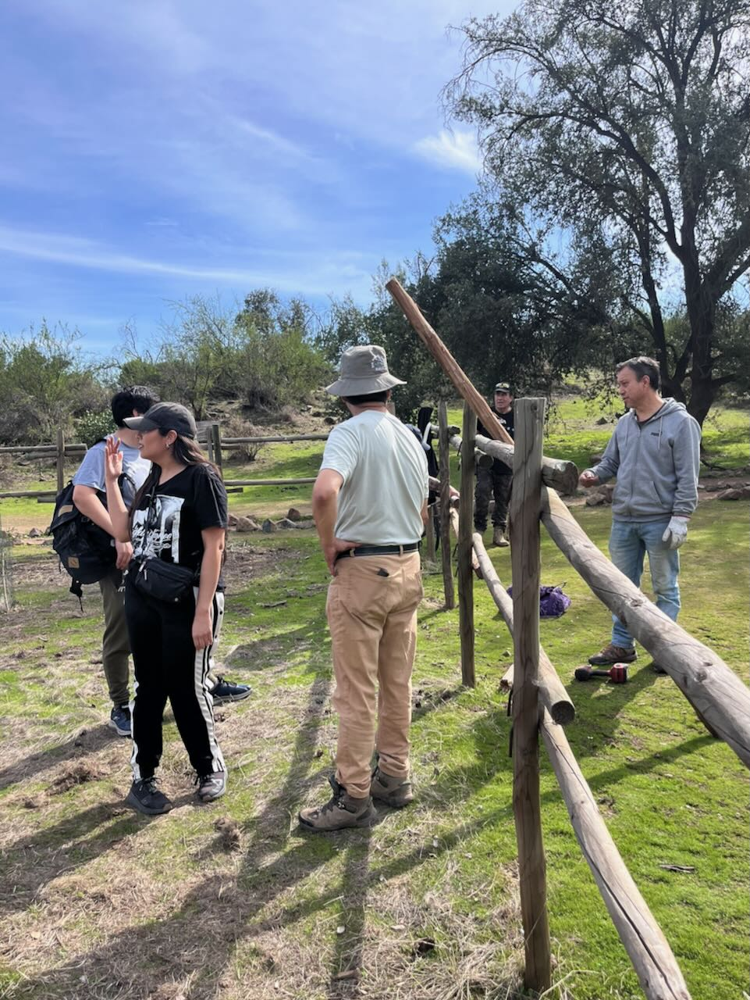
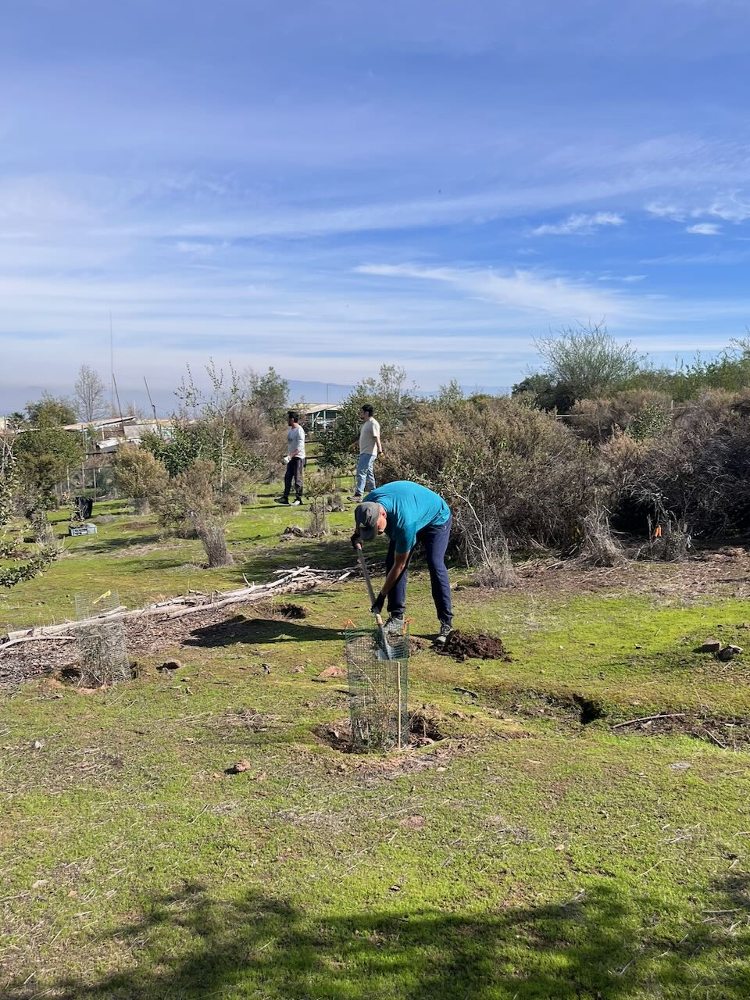
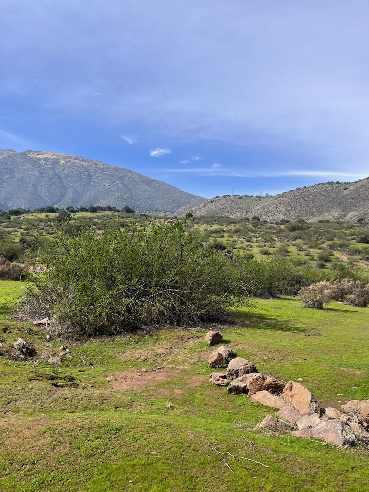
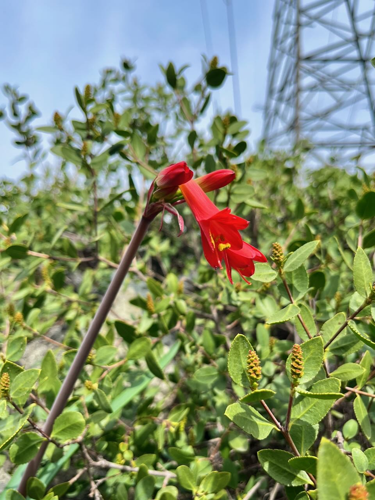
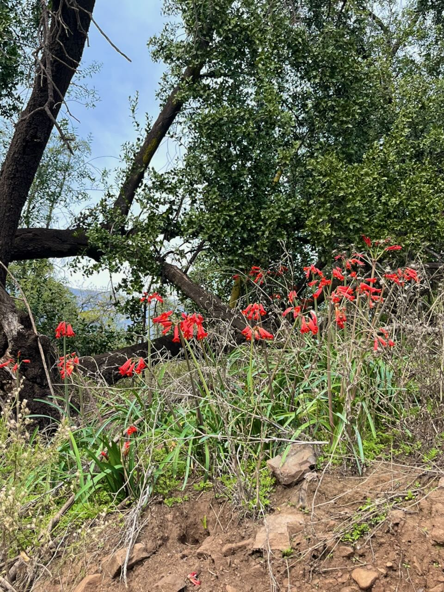
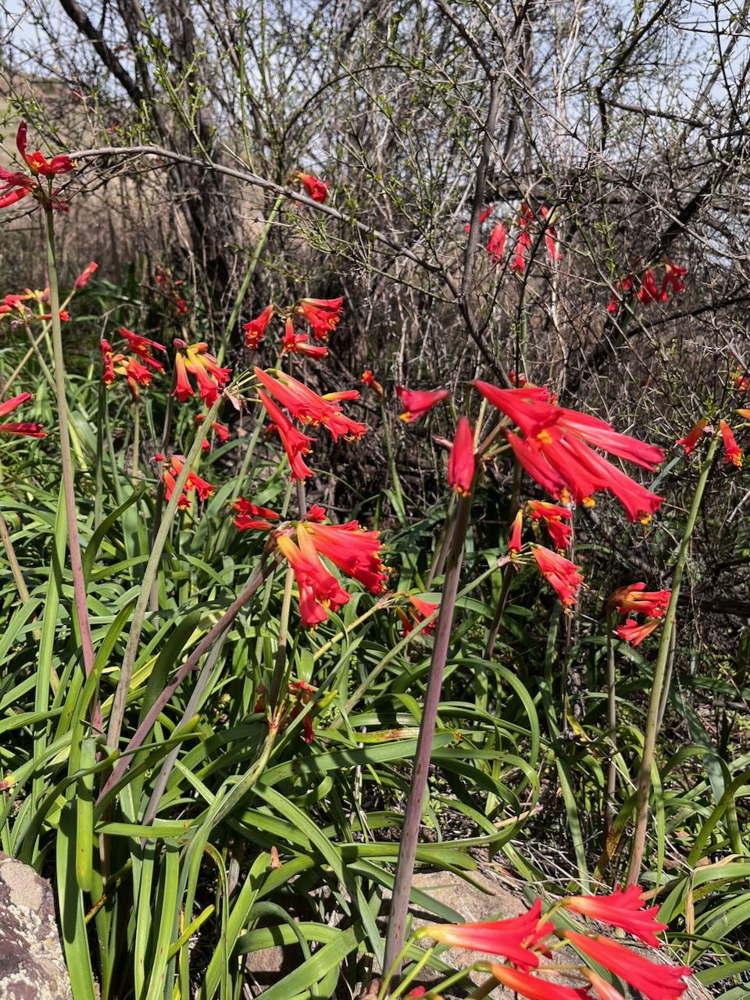

Realizamos una jornada de reparación de las vallas que protegen la zona de reforestación en la entrada del bosque y parque comunitario Panul. Nos reunimos cerca de 8 voluntarios/as con nuestras herramientas y reemplazamos varios palos de la reja, reparamos otros cuantos, y se plantaros algunos árboles más que trajeron.

:::{.galeria}
{.fotito}
{.fotito}
{.fotito}
{.fotito}
{.fotito}
:::

Luego me fui a recorrer el bosque en bici camino a la Quebrada de Macul, buscando tierrita. Encontré muchas Añañucas rojas en el camino.

:::{.galeria}
{.fotito}
{.fotito}
{.fotito}
:::

Para quienes no lo conozcan, el Panul es un bosque ubicado en la comuna de La Florida, al cual se puede llegar caminando, en bicicleta o en transporte público subiendo por la calle Rojas Magallanes hasta arriba.

:::: {.centrar}
::: {.openstreetmap}
<iframe width="380" height="300" src="https://www.openstreetmap.org/export/embed.html?bbox=-70.53850293159486%2C-33.53799651157129%2C-70.5307459831238%2C-33.531852661587585&amp;layer=hot&amp;marker=-33.53492464115856%2C-70.53462445735931" style="border: 1px solid black"></iframe>
:::
::::