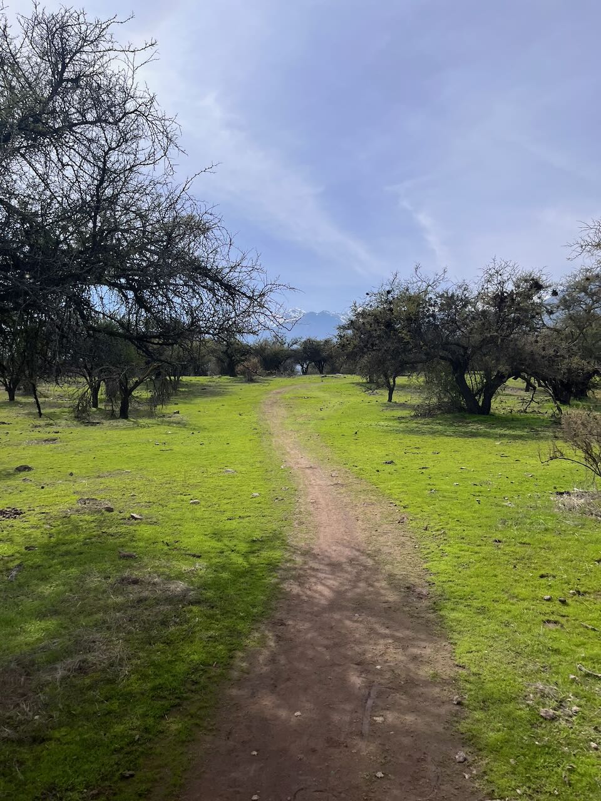
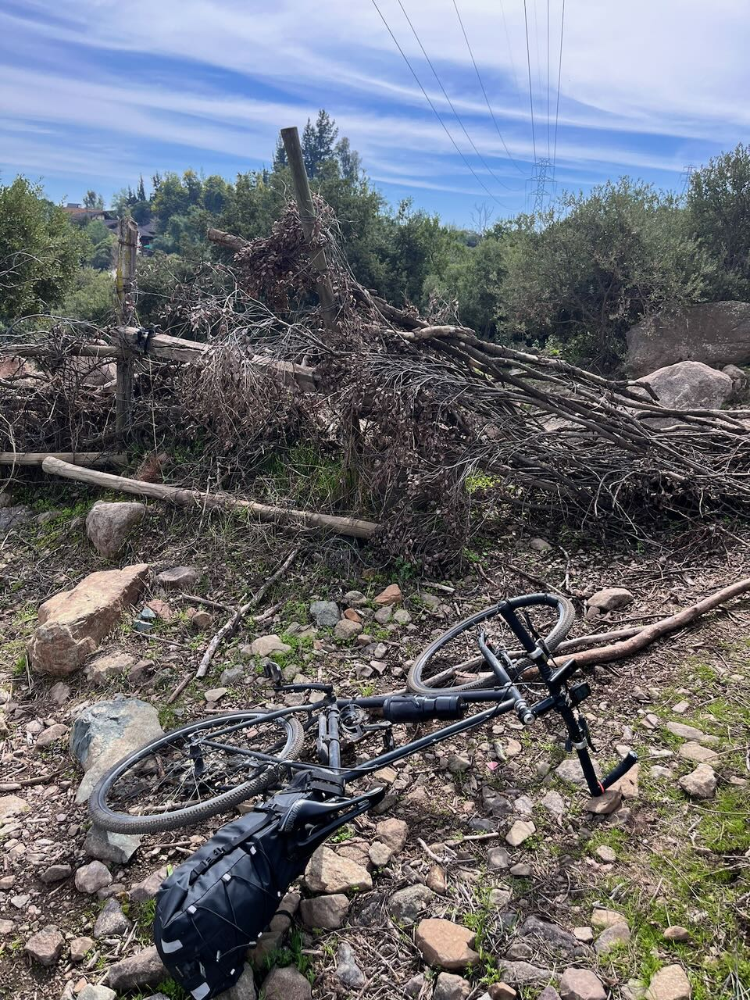
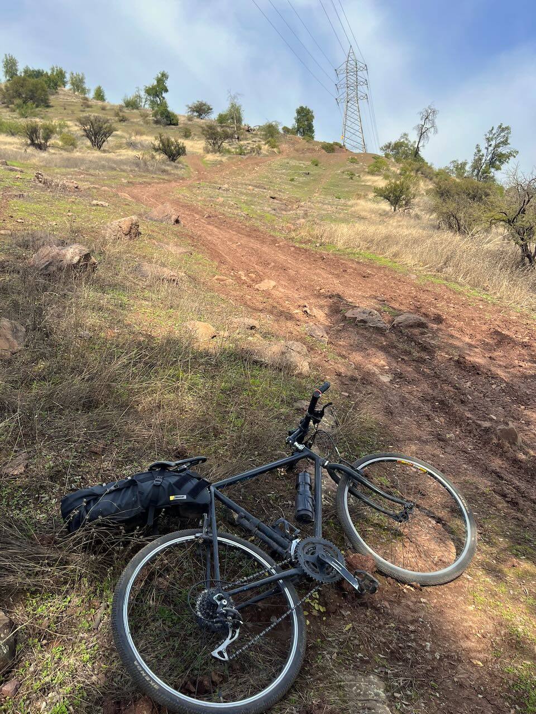
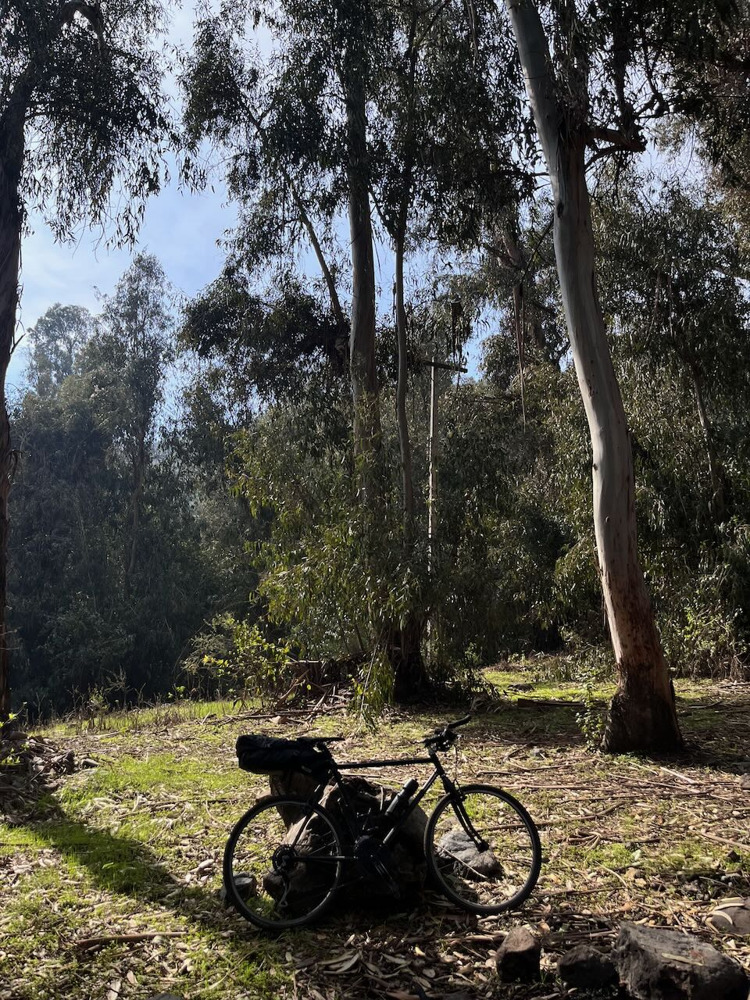
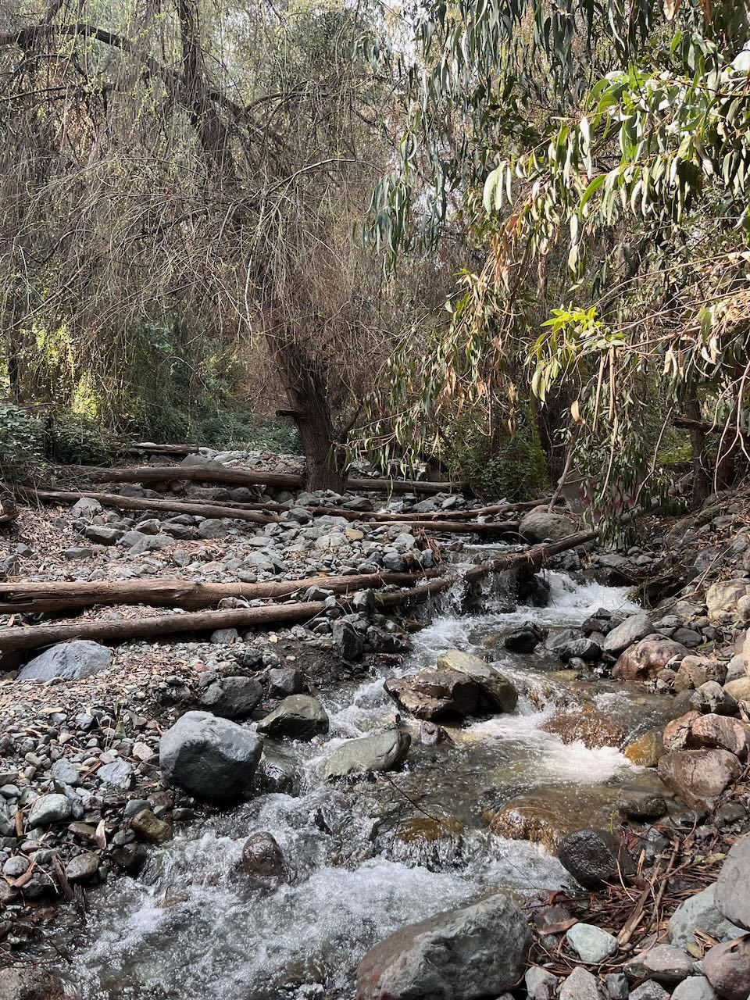
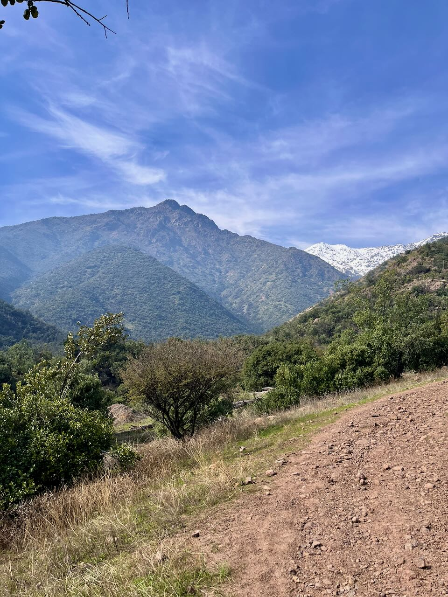
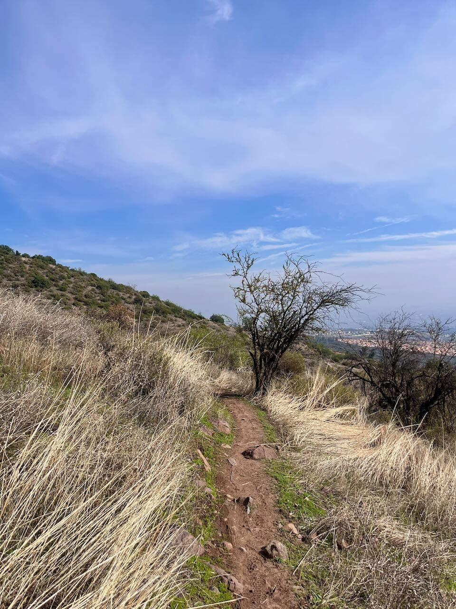
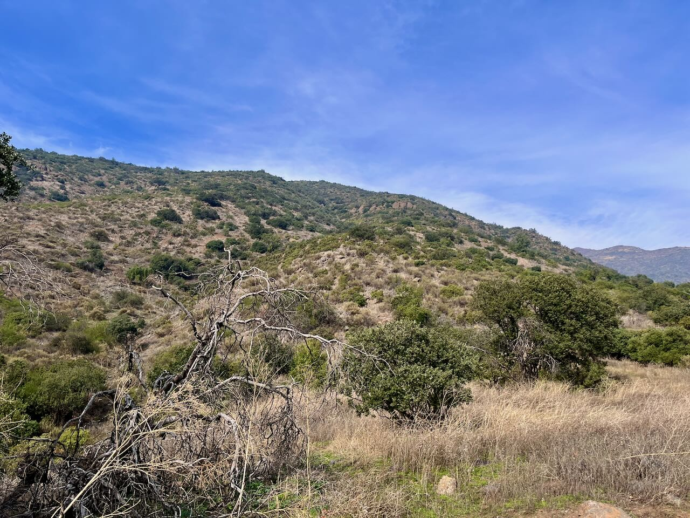
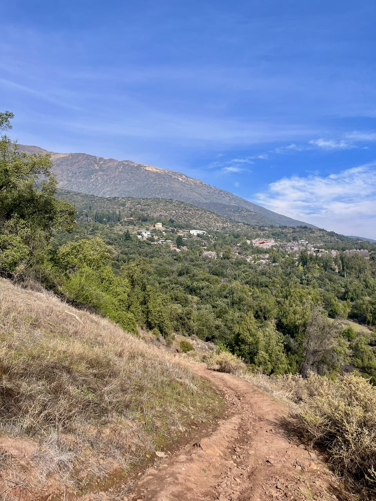
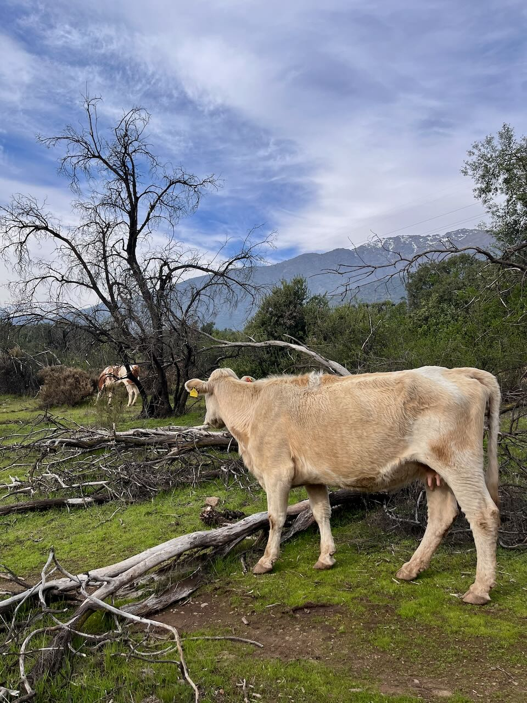

Después de ayudar en [reparaciones de la reforestación del bosque Panul](/posts/2026/2026-08-23/), seguí pedalando por la precordillera, subiendo por el sendero de los Eucaliptus del Panul, para llegar a la segunda corrida de antenas y cruzar la comunidad ecológica hacia el norte por la variante Rusa que le llaman, en camino al sector de Santa Sofía de Macul. Ahí fue donde vi varias Añañucas:

:::{.galeria}
{.fotito .lightbox group="Panul"}
{.fotito .lightbox group="Panul"}
{.fotito .lightbox group="Panul"}
{.fotito .lightbox group="Panul"}
{.fotito .lightbox group="Panul"}
{.fotito .lightbox group="Panul"}
:::

Llegando allá di unas vueltas por el circuito (lamentablemente cortaron casi todos los arbustos y árboles de la zona), almorcé un pancito con queso y tomate, y me puse a subir en paralelo al río de la Quebrada de Macul.

:::{.galeria}
{.fotito .lightbox group="Panul"}
{.fotito .lightbox group="Panul"}
{.fotito .lightbox group="Panul"}
:::

Luego empieza un sendero angosto que bordea la precordillera con cierta altura, que llega a una reserva ecológica. El sendero tiene momentos técnicos (bajadas bruscas, con harta roca, subidas demasiado empinadas). También es recorrido por hartos caballos.

:::{.galeria}
{.fotito .lightbox group="Panul"}
{.fotito .lightbox group="Panul"}
{.fotito .lightbox group="Panul"}
:::

:::{.mapa}

```{r cargar}
library(sf)

ruta <- read_sf("Gravel_Panul_Quebrada_de_Macul_Panul.gpx", "tracks")
```

```{r recortar}
gravel <- ruta |> 
  st_crop(xmin = -70.541, xmax = -70.5, 
          ymin = -33.551, ymax = -33.50)

# library(ggplot2)
# 
# ruta |>
#   st_crop(xmin = -70.541, xmax = -70.5, 
#           ymin = -33.551, ymax = -33.50) |> 
#   ggplot() +
#   geom_sf()
```

```{r mapa}
library(mapgl)

maplibre(
  style = carto_style("dark-matter"),
  bounds = st_buffer(gravel, dist = 1000),
  zoom = 13,
  minZoom = 7,
  bearing = 1.2,
  attributionControl = FALSE
) |>  
  add_line_layer(
    id = "ruta",
    source = gravel,
    line_color = "#DD2594",
    line_width = 2)
```

:::

Al final volví a cruzar hacia el Panul y luego al Zavala, bajando muy lentito por el sendero Dos Peumos (tiene demasiadas piedras grandes para mi tipo de bicicleta), donde vi varias vacas.

::::{.centrar}
:::{style="max-width: 300px"}
{.foto .lightbox group="Panul"}
:::
::::

Aquí dejo la actividad de Strava:

:::{.strava .centrar}
<div class="strava-embed-placeholder" data-embed-type="activity" data-embed-id="19871348554" data-style="standard" data-from-embed="false" data-token="CsZNZ-UdO6fA7njuhSei3_p84dNs7_vx_h0EE9rlxb0"></div><script src="https://strava-embeds.com/embed.js"></script>
:::