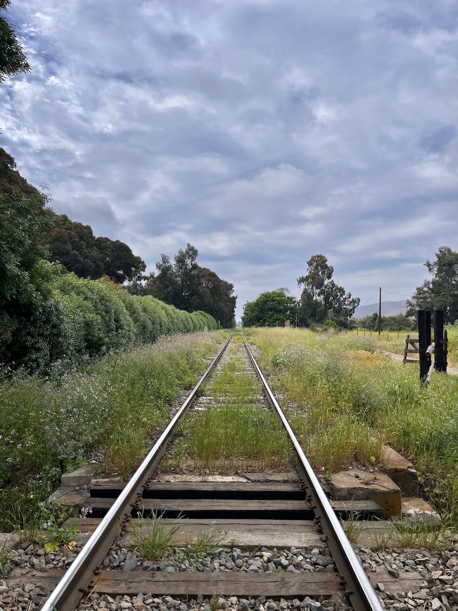
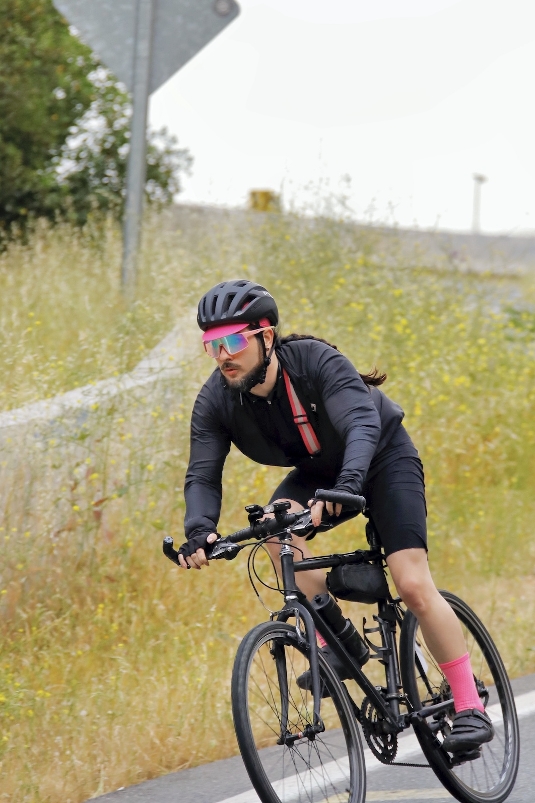
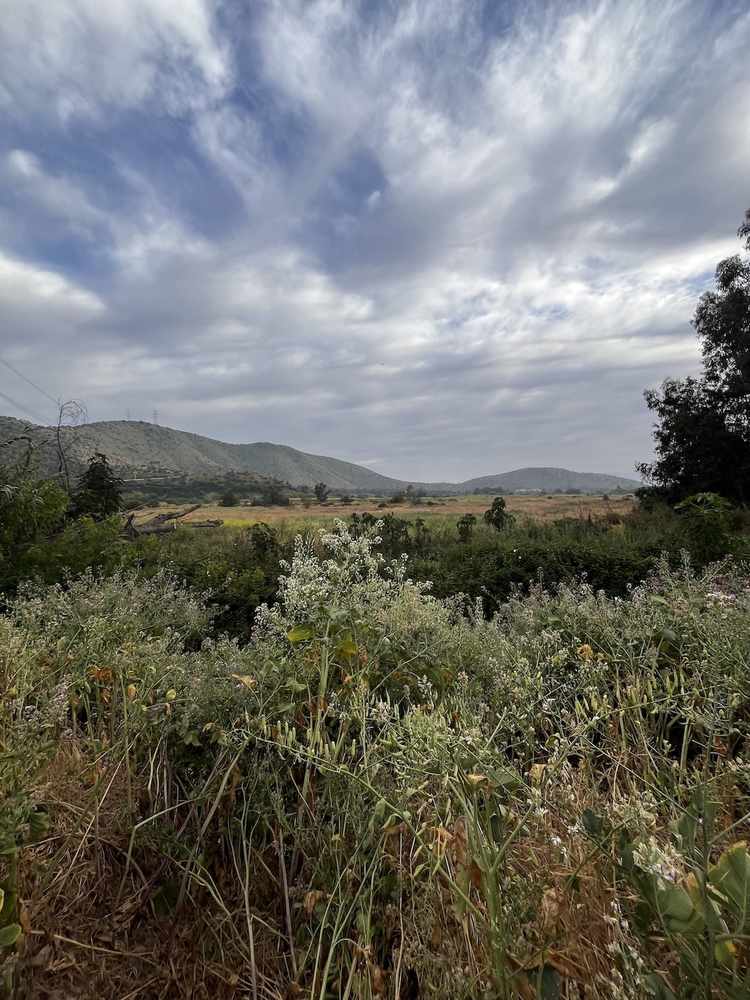
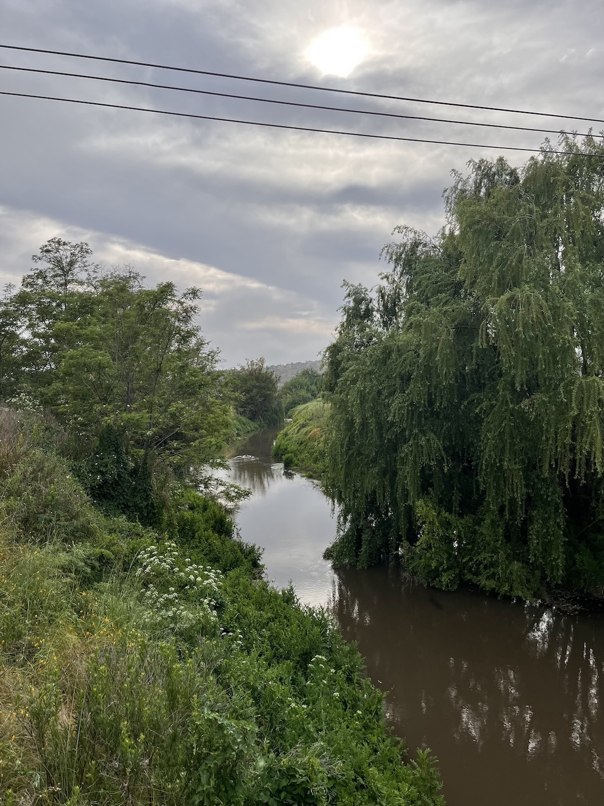
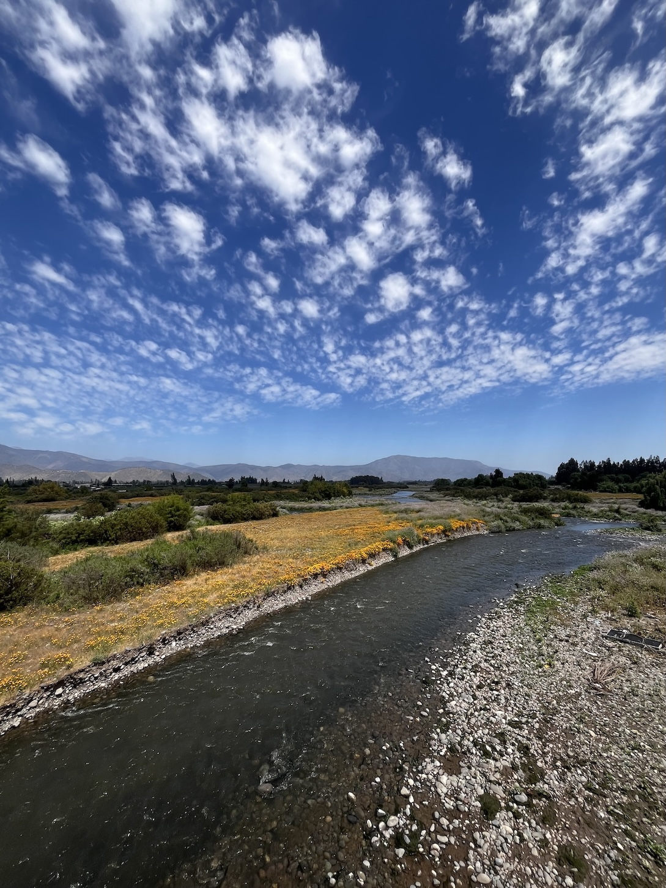
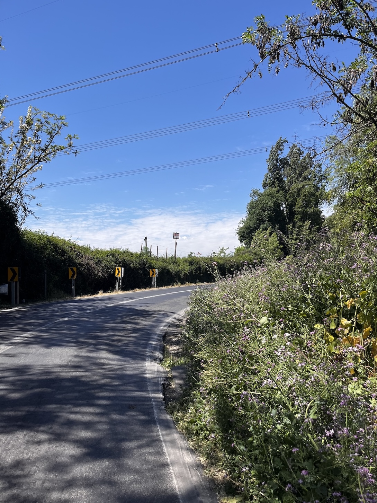

Una ruta preciosa, toda en solitario como casi siempre, dentro de un tiempo aceptable para mi. Un perro chico me mordió en Melipilla 😞

:::: {.galeria}
{.fotito .lightbox group="melipilla"}
{.fotito .lightbox group="melipilla"}
{.fotito .lightbox group="melipilla"}
{.fotito .lightbox group="melipilla"}
{.fotito .lightbox group="melipilla"}
{.fotito .lightbox group="melipilla"}
::::

:::: {.tabla_ciclismo}
| Variable                | Valor     |
|------------------------:|-----------|
|**Distancia total:**     | 204.37 km |
|**Ascenso acumulado**    | 1,180 m   |
|**Velocidad promedio:**  | 23.1 km/h |
|**Tiempo en movimiento** | 8:49:52   |
|**Tiempo total**         | 10:59:49  |
::::

:::: {.strava .centrar}

::::

:::: {.centrar}
::: {.tiktok}
<iframe src="https://www.tiktok.com/embed/v2/7563461146947112212" height="740" width="400"></iframe>
:::
::::