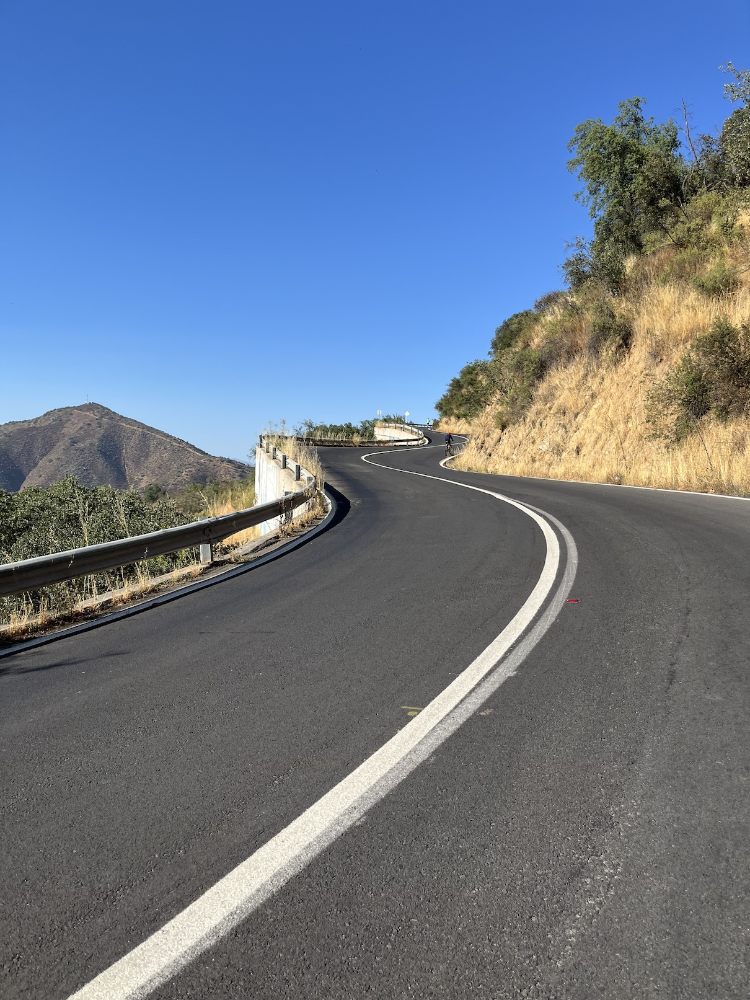
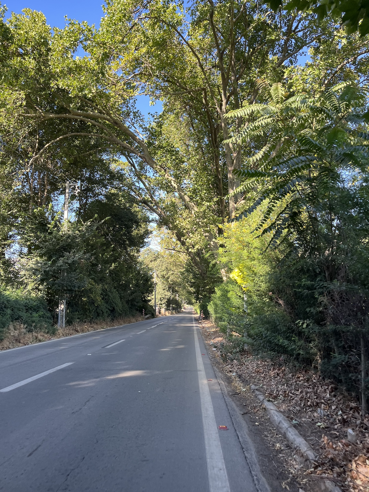
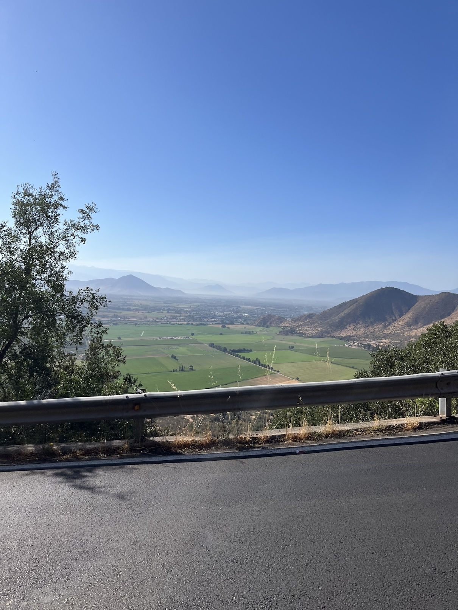
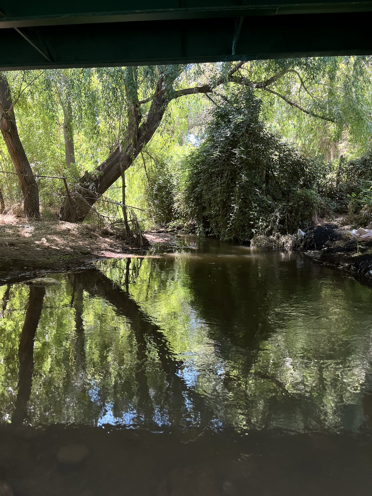
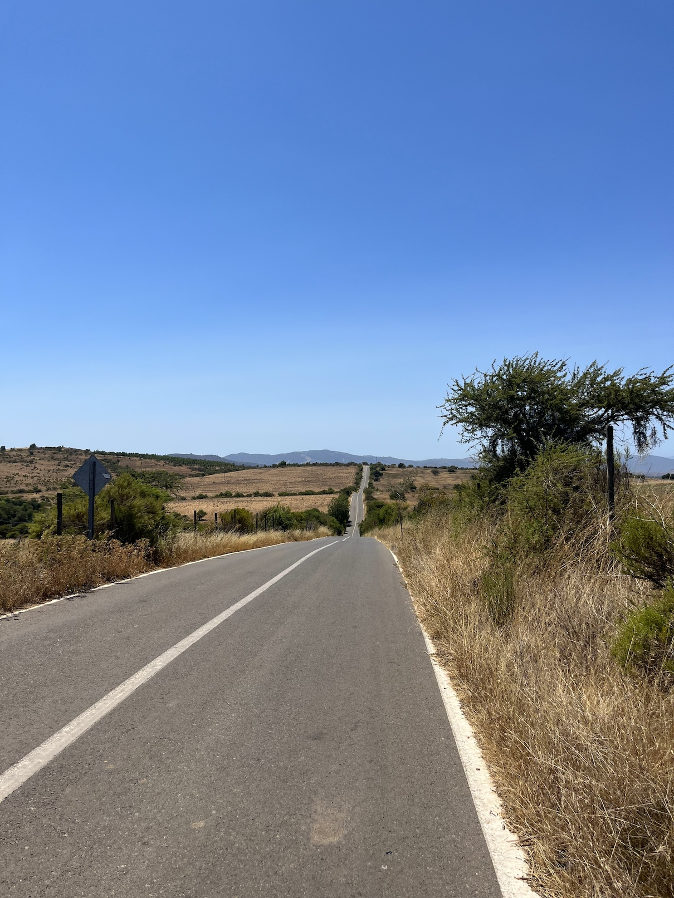
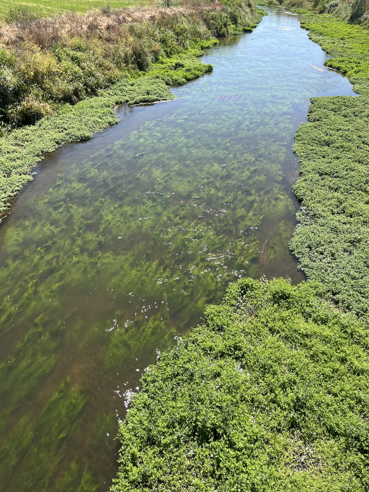
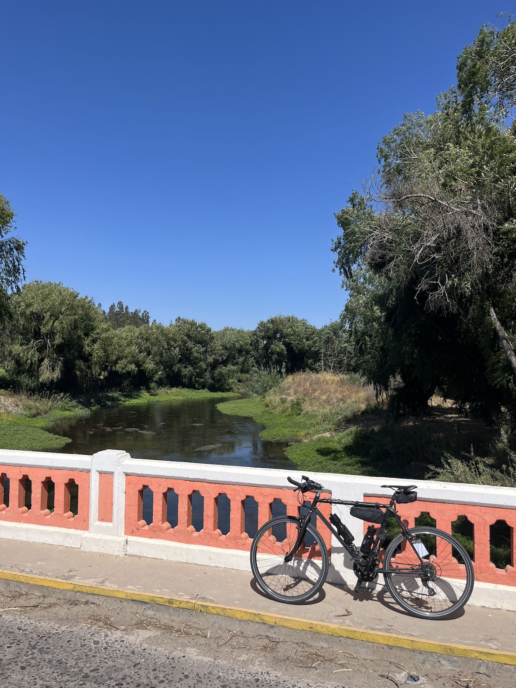
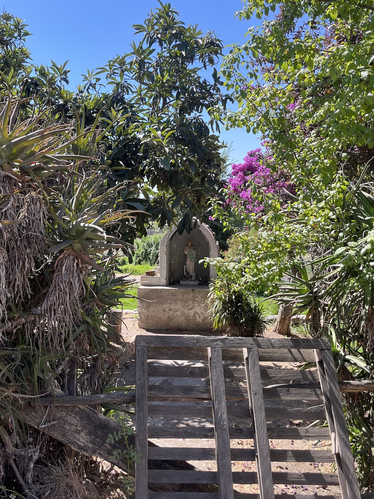
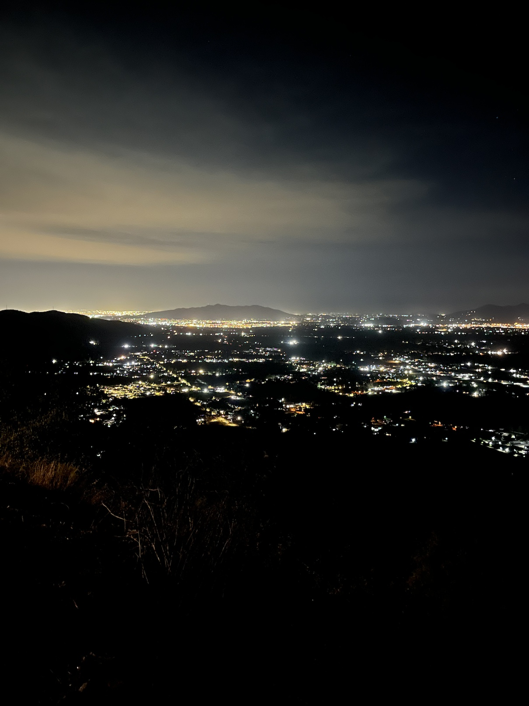

No alcancé a terminar esta brevet dentro del tiempo reglamentario (13 horas), principalmente porque pinché muchas veces, pero la disfruté igual porque estuve con mi amigo de rutas Óscar casi todo el transcurso (hasta que se retiró en Melipilla), y después conocí a Sebastián, con quien hice el último tramo.

::: {.galeria .centrar}
{.fotito .lightbox group="sanpedro"}
{.fotito .lightbox group="sanpedro"}
{.fotito .lightbox group="sanpedro"}
{.fotito .lightbox group="sanpedro"}
{.fotito .lightbox group="sanpedro"}
{.fotito .lightbox group="sanpedro"}
{.fotito .lightbox group="sanpedro"}
{.fotito .lightbox group="sanpedro"}
{.fotito .lightbox group="sanpedro"}
:::

Quedamos fuera de tiempo antes de subir la cuesta Barriga, y al otro lado de la cuesta Óscar se ofreció a llevarme en auto a mi casita. Parte bonita del ultraciclismo es conocer gente en la misma situación de cansancio/sufrimiento/dolor que unx, y compartir la ruta apoyándose mutuamente.

:::: {.tabla_ciclismo}
| Variable                | Valor     |
|------------------------:|-----------|
|**Distancia total:**     | 208.87 km |
|**Ascenso acumulado**    | 2,007 m   |
|**Velocidad promedio:**  | 21.3 km/h |
|**Tiempo en movimiento** | 9:48:12   |
|**Tiempo total**         | 14:48:11  |
::::

La ruta igual tenía secciones riesgosas, particularmente después de Melipilla por el camino de la Fruta, donde la pista es angosta y con poca o nula berma.

::: {.strava .centrar}

:::

Grabé varios videos cortitos del paisaje durante la ruta. Habían paisajes preciosos, muchos cuerpos de agua, y vaquitas. El sector de **San Pedro** me encantó por la cantidad de cerros y actividad agrícola, pero más que nada por los repechos increíbles de casi 20% de inclinación 🔥

:::: {.centrar}
::: {.tiktok}
<iframe src="https://www.tiktok.com/embed/v2/7596681175847030037" height="740" width="400"></iframe>
:::
::::