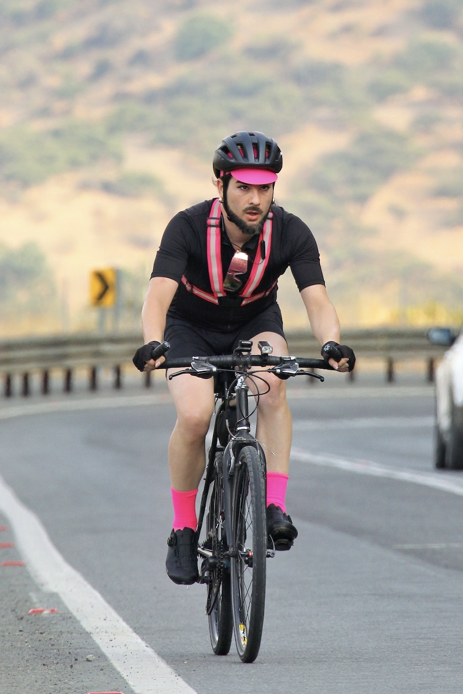

Una Brevet compleja, pero que enfrenté con un muy buen rendimiento, y que terminé en poco tiempo (para mi estándar, que es ocupar el 100% del tiempo límite reglamentario),

Me tomaron una foto sufriendo en el ascenso de la cuesta Chada:

::: {.centrar}
{.foto .lightbox}
:::

Al partir la Brevet me sumé a una grupeta con la que avanzamos a muy buena velocidad hasta Lonquén, donde ya no pude aguantarme las ganas de pipí y me tuve que separar. Realmente ayuda mucho ir en grupo!

:::: {.tabla_ciclismo}
| Variable                | Valor     |
|------------------------:|-----------|
|**Distancia total:**     | 294.80 km |
|**Ascenso acumulado**    | 2,313 m   |
|**Velocidad promedio:**  | 22.3 km/h |
|**Tiempo en movimiento** | 13:13:17  |
|**Tiempo total**         | 16:23:04  |
::::

Durante el transcurso tuve un problema mecánico con un perno suelto de la fijación de mis zapatillas, que casi me hizo sacarme la chucha llegando a Rancagua, pero que pude solucionar gracias a un taller de bicicletas en Machalí.

Quedé muy feliz con mi velocidad promedio 🥰

:::: {.strava .centrar}

::::