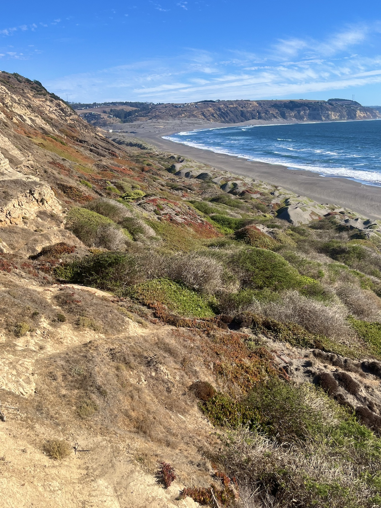
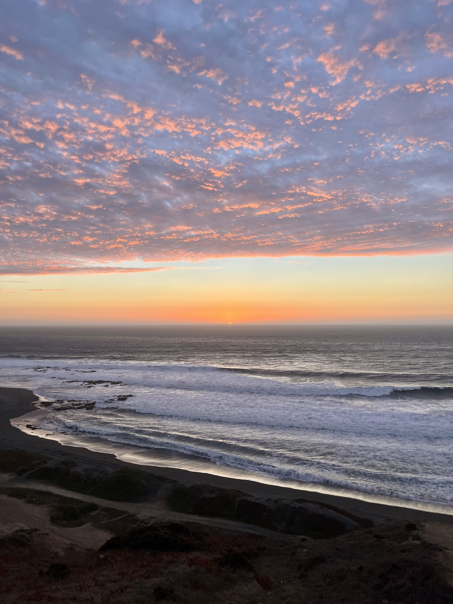
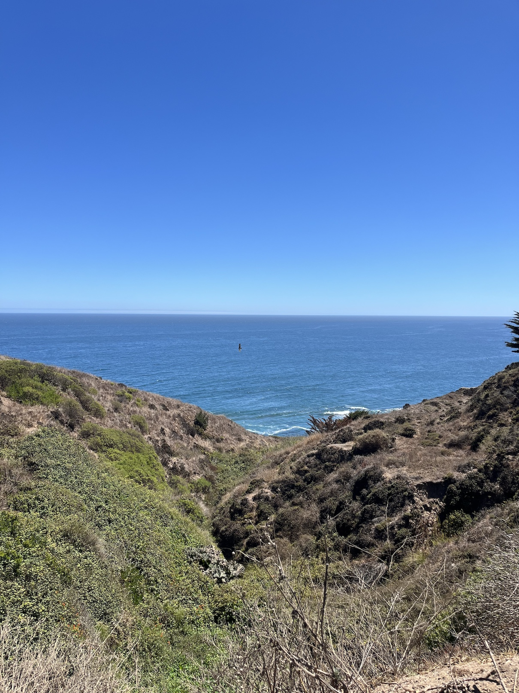
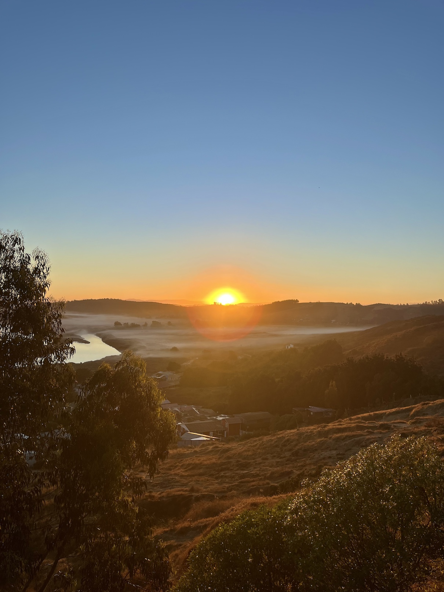
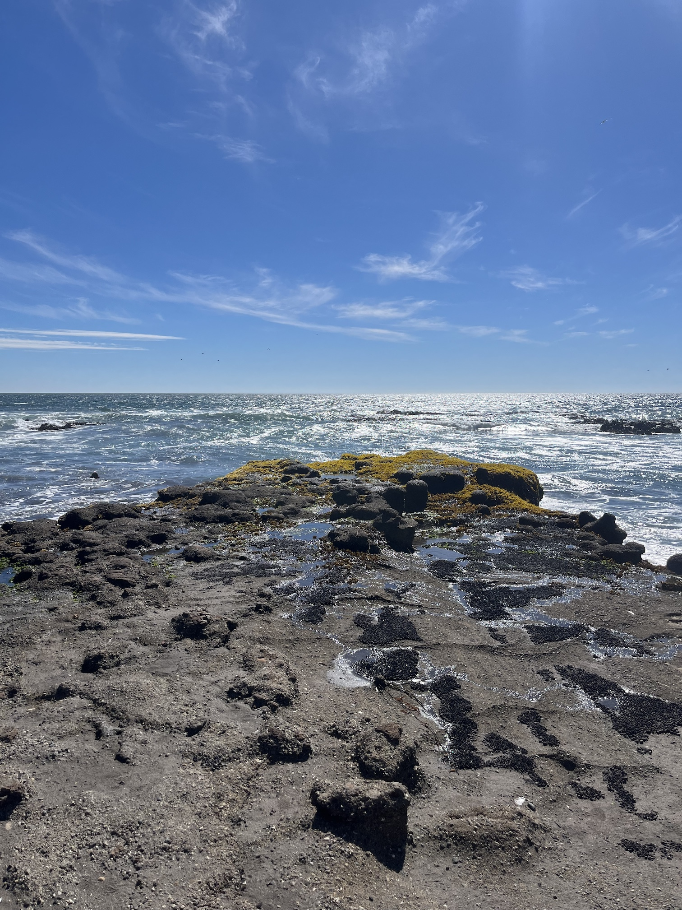

Me fui de vacaciones en solitario a **La Boca**, comuna de Navidad, región de O'Higgins. Fui con mi bicicleta y mi plan era aprovechar todos los días para entrenar y explorar la comuna. 

El territorio de Navidad se caracteriza por la **desembocadura del Río Rapel**, pero también por sus **campos y cerros**, muchos de ellos con caminos de tierra, así que andar con neumáticos de **gravel** fue perfecto.

::: {.galeria .centrar}
{.fotito .lightbox group="navidad"}
{.fotito .lightbox group="navidad"}
{.fotito .lightbox group="navidad"}
{.fotito .lightbox group="navidad"}
{.fotito .lightbox group="navidad"}
:::

----

### Desde Litueche a La Boca

Me fui en bus desde Santiago a Litueche para llegar _cerca_ de mi destino, pero _no tan cerca_, para llegar pedaleando y conocer el camino[^1]. Así que esta ruta fue modo _bikepacking_, con seatbag lleno de ropa, bolso delantero y mochila.

::: {.strava .centrar}

:::

[^1]: Quería irme de Santiago en bicicleta (lo había hecho antes) pero mejor decidí guardar piernas para la estadía allá.

### Cruzando por los cerros

La primera ruta real en **gravel** fue por los cerros de La Aguada/La Vinilla, pasado Rapel. Luego de unas subidas de pura tierra de entre 10% a **18% de pendiente**, fueron unos maravillosos 16 kilómetros de pura **tierra** por encima de unos cerros aislados.

::: {.strava .centrar}

:::

### Explorando caminos de tierra
Busqué senderos de tierra más cercanos a La Boca, con reusltados mixtos.

Mi primer intento fue tratar de pasar por la orilla del río Rapel en camino a la Vega de La Boca, para lo que pasé abriendo cercos por unos pastizales de ganado, pero una señora misteriosa me dijo que no había salida por el otro lado del peladero porque habían construido casas.

::: {.strava .centrar}

:::

En el sector de **El Bajío** hay bajadas al río de tierra y piedras pequeñas, donde se pueden ver muchas **aves**, y se puede pedalear por huellas de vehículo por camino de tierra hasta **Licancheu**, por la orilla del río.

**Licancheu** es un pueblo de campo hermoso, con mucho verde, casas antiguas, y un pintoresco **museo** que recomiendo visitar.

### Parque Reserva El Maitén

Caché que existe una reserva natural privada donde existen pistas de **ciclismo de montaña**, y fui a conocer. La entrada vale $10.000 pero el parque es muy bonito, con excelente mantención e instalaciones. Lamentablemente las pistas eran **demasiado técnicas** para mi, porque hasta las más básicas me costaron mucho por las bajadas empinadas. Pero igual lo pasé bien, sobre todo en el sector de pinos, bajo la sombra de altos árboles con el piso naranjo.

::: {.strava .centrar}

:::

## La Agüada

::: {.strava .centrar}

:::

## Museo de Licancheu y gruta Los Motores

::: {.strava .centrar}

:::

## De regreso a Litueche

::: {.strava .centrar}

:::

