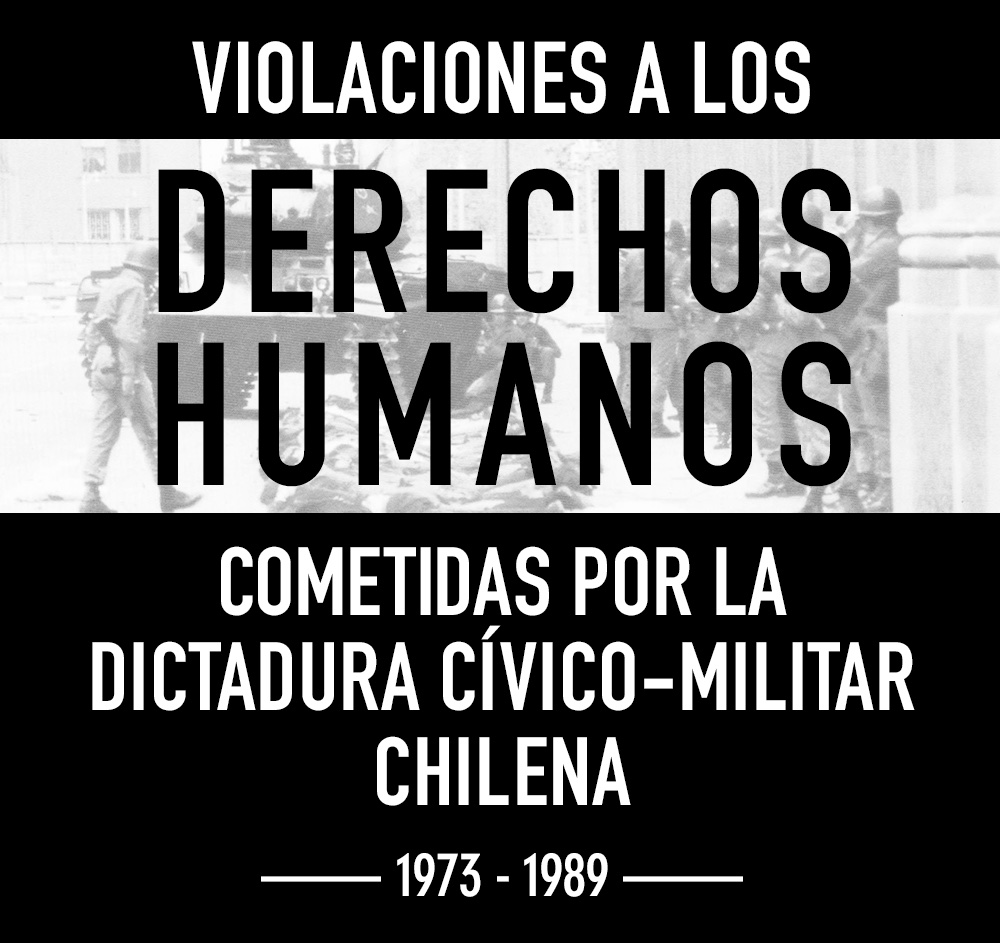

:::: {.boton style="width: 210px;"}
[ Ver infografía](https://bastianolea.github.io/violaciones_ddhh_chile/)
::::

[Infografía](https://bastianolea.github.io/violaciones_ddhh_chile/) que recopila visualizaciones de datos acerca de los crímenes de lesa humanidad cometidos por el régimen dictatorial en Chile, entre entre 1973 y 1989.

El objetivo es poder compartir información de forma pedagógica y clara, para que las nuevas generaciones puedan comprender la magnitud de las violaciones a los derechos humanos cometidas en ese período, y así contribuir a la memoria histórica del país.

Aquí dejo un video cortito que hice mostrando la página web y explicando un poco las motivaciones:

::: {.tiktok}
<blockquote class="tiktok-embed" cite="https://www.tiktok.com/@bastimapache/video/7546064357159947525" data-video-id="7546064357159947525" style="border: none; min-width: 340px; margin: auto;" > <section> <a target="_blank" title="@bastimapache" href="https://www.tiktok.com/@bastimapache?refer=embed">@bastimapache</a> Septiembre es el mes de la memoria! Revisa la infografía en  el link de mi perfil, y ayúdame a mejorarla 🙏🏼 <a title="chile" target="_blank" href="https://www.tiktok.com/tag/chile?refer=embed">#chile</a> <a title="septiembre" target="_blank" href="https://www.tiktok.com/tag/septiembre?refer=embed">#septiembre</a> <a target="_blank" title="♬ Ventolera - Quilapayún" href="https://www.tiktok.com/music/Ventolera-7033714786298775554?refer=embed">♬ Ventolera - Quilapayún</a> </section> </blockquote> 
:::

**Se buscan aportes de contenido**, como por ejemplo relatos, estadísticas y datos, contribución de textos y similares. [Contáctame!](https://bastianolea.rbind.io/contact/)

:::: {.centrar}
::: {.boton style="width: 210px;"}
[ Ver infografía](https://bastianolea.github.io/violaciones_ddhh_chile/)
:::
::::

### Actualizaciones

- 10/09/2025: fichas de principales violadores de derechos humanos: Krasnoff, Contreras, Corvalán, Romo y Moren.
- 10/09/2025: apartados con caso de los 119, caso de Michel Nash, y caso degollados
- 09/09/2025: apartado sobre censura
- 08/09/2025: apartado sobre segregación, posibilidad de hacer zoom a fotos
- 07/09/2025: apartado sobre infancias, línea de tiempo
- 03/09/2025: apartados con relatos sobre casos insignes de víctimas: caso Sebastián Acevedo y caso quemados
- 01/09/2025: secciones dispersas de testimonios de sobrevivientes
- 31/08/2025: nueva sección de mujeres detenidas desaparecidas embarazadas

### Notas técnicas

La página fue construida completamente usando [Quarto desde RStudio](https://bastianolea.rbind.io/blog/quarto_reportes/), publicando el sitio gratuitamente a [GitHub Pages.](https://bastianolea.rbind.io/blog/tutorial_quarto_github_pages/)
