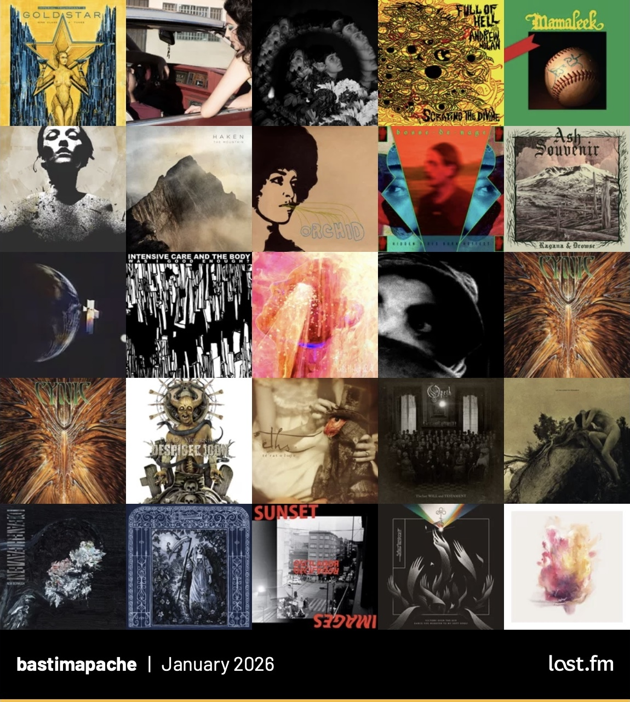

Álbumes más escuchados según [mi perfil de Last.fm](https://www.last.fm/user/bastimapache). Incluye discazos como el nuevo de Deafheaven, discos de Ragana, y The Body.

::: {.centrar}
{style="max-width: 480px;"}
:::

 Este mes escuché más black metal, noise, y metal progresivo.

### Álbumes destacados
* _Goldstar_, de los gigantes [Imperial Triumphant](https://www.last.fm/music/Imperial+Triumphant), que mezclan metal progresivo pesado y oscuro con tintes de jazz y una estética art déco. Además [vinieron a Chile](/posts/musica/conciertos/) este mes.
* _Lonely People With Power_, nuevo disco de [Deafheaven](https://www.last.fm/music/Deafheaven), una de mis bandas favoritas y uno de los gigantes del blackgaze. Álbum culiao increíble de principio a fin.
* _Desolation's Flower_ y _Ash Souvenir_ de [Ragana](https://www.last.fm/music/Ragana/), una banda femenina increíble de black metal experimental, atmosférico y pesado.