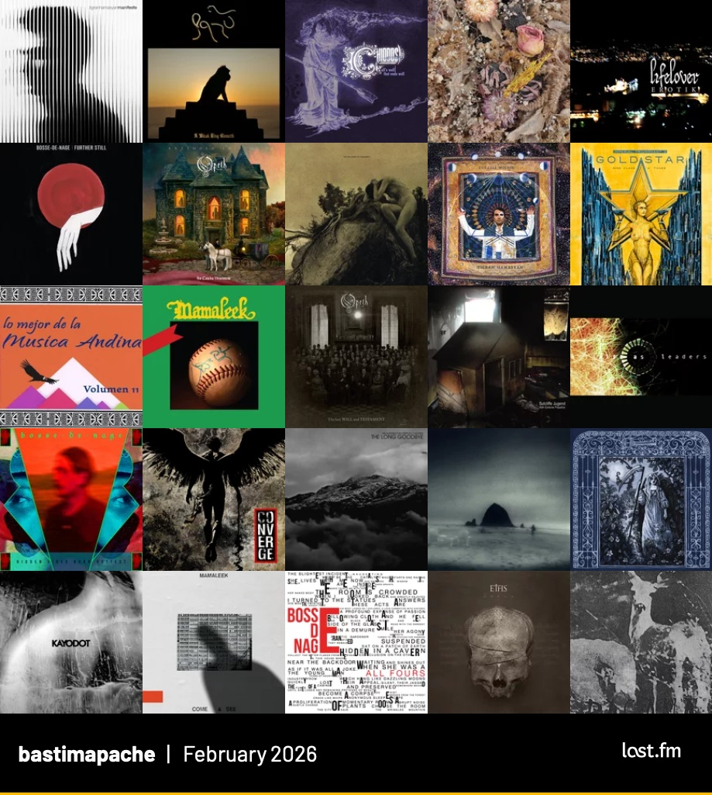

Resumen de los álbumes más escuchados según [mi perfil de Last.fm](https://www.last.fm/user/bastimapache). Me llama la atención que este mes incluye varios discos que no son de mi rotación común.

::: {.foto .centrar}
{.lightbox}
:::

Este mes escuché más black metal, metal progresivo, y jazz fusión.

### Álbumes destacados
* _Manifeste_ y _The Call Within_ de [Tigran Hamasyan](https://www.last.fm/music/Tigran+Hamasyan), uno de mis artistas favoritos por su mezcla de piano, jazz, poliritmos de metal o _djent_ y música oriental/armenia.
* _Vida Blue_ de [Mamaleek](https://www.last.fm/music/Mamaleek), un gran álbum de post black metal experimental.
* _Further Still_ y _All Fours_ de [Bosse-de-Nage](https://www.last.fm/music/Bosse-de-Nage), una de mis bandas favoritas por su experimentación con un black metal atmosférico y cargado de emociones.
* _Erotik_ de [Lifelover](https://www.last.fm/music/Lifelover), porque me compré la entrada para el concierto que van a tener en septiembre de este año en Santiago.
* _Labyrinthine_ de [Faetooth](https://www.last.fm/music/Faetooth), un disco pesado y lento con voces femeninas.