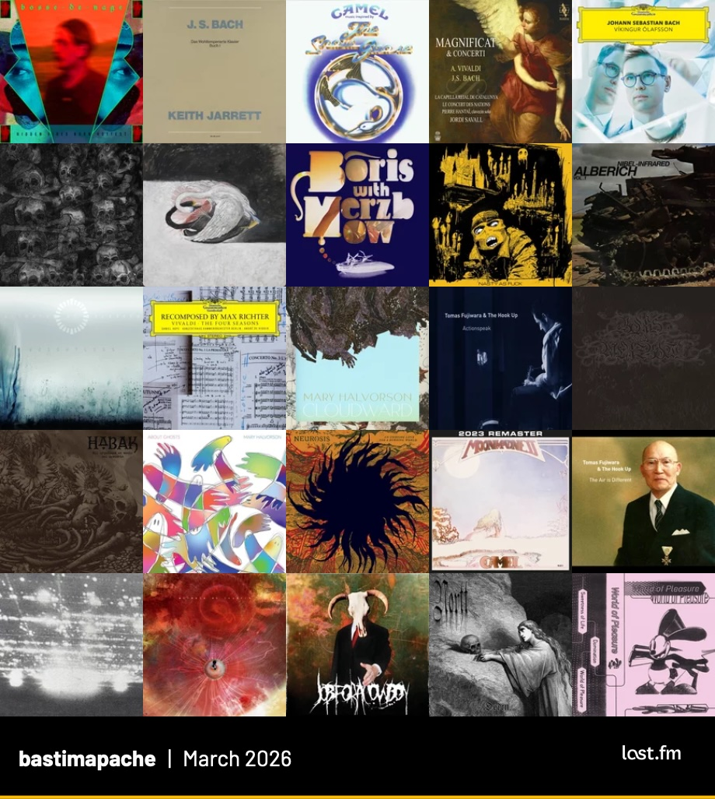

Resumen de los álbumes más escuchados durante marzo de 2026 según [mi perfil de Last.fm](https://www.last.fm/user/bastimapache). 

::: {.foto .centrar}
{.lightbox}
:::

Este mes sigue liderando _Hidden Fires Burn Hottest_, lo nuevo de **Bosse-de-Nage** con su post black metal lleno de emoción y crudeza poética.

También hay álbumes increíbles como _[Rock Dream](https://www.last.fm/music/Boris+with+Merzbow/Rock+Dream)_ de **Boris con Merzbow**, un disco en vivo que potencia el rock pesado y psicodélico de Boris con el implacable ruido improvizado de Masami Akita.

Hay harto ruido con **[Psywarfare](https://www.last.fm/music/Psywarfare)**, **[Alberich](https://www.last.fm/music/Alberich)** y **[Yellow Swans](https://www.last.fm/music/Yellow+Swans)**, y también destaco el _blackened hardcore_ de **[The Secret](https://www.last.fm/music/The+Secret)**.

Como siempre, mucho de mi jazzista favorita, **[Mary Halvorson](https://www.last.fm/music/Mary+Halvorson)**, en sus múltiples colaboraciones.