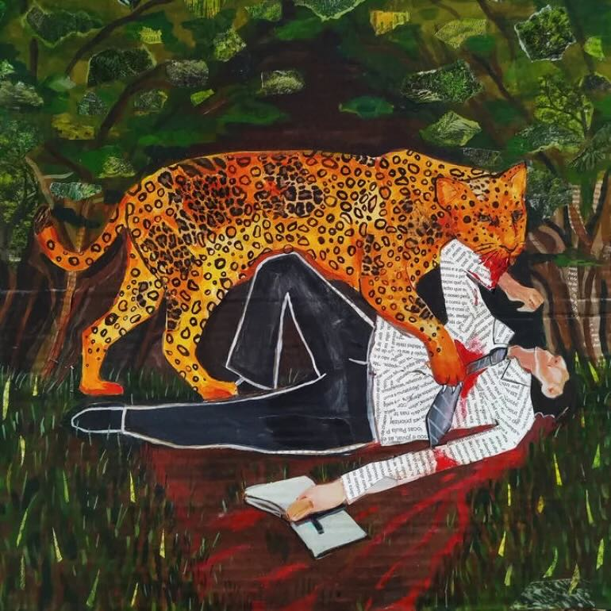
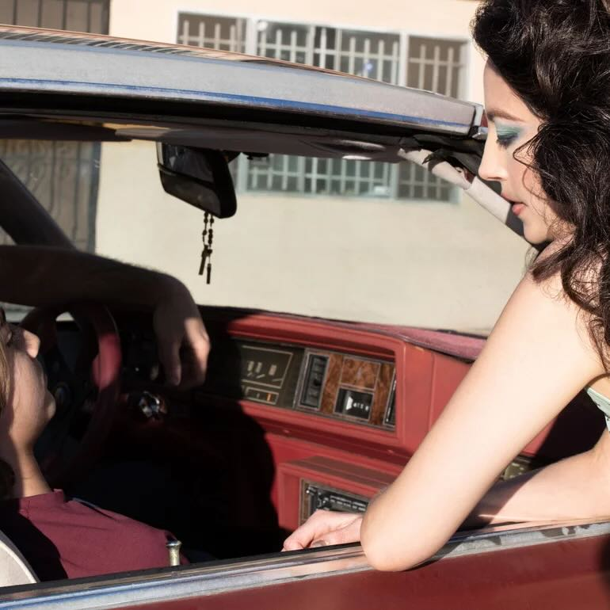
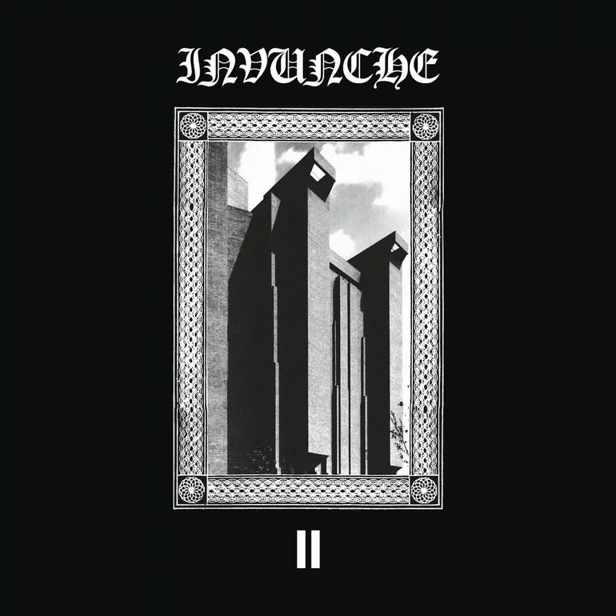
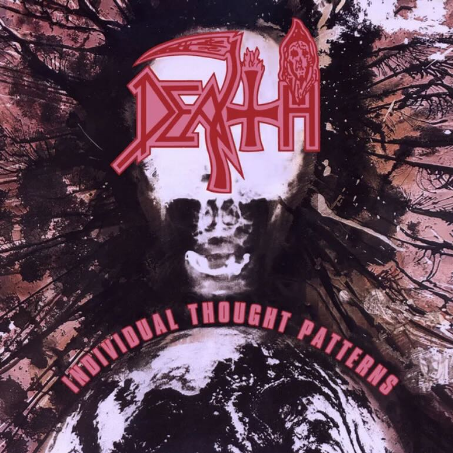
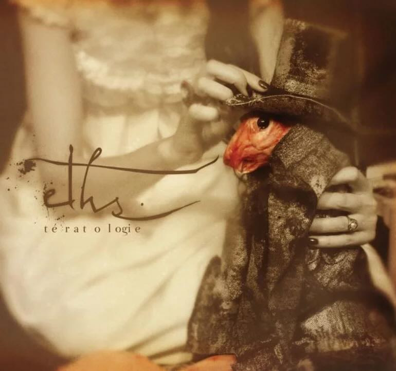
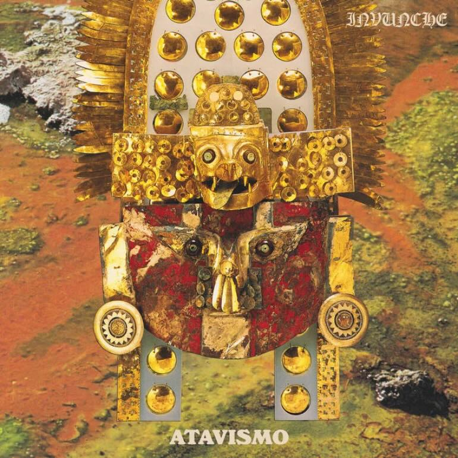

Comparto algunos de los álbumes que más he escuchado durante el año, con breves reseñas de cada uno de ellos. Entre los destacados: _No Ritmo Da Terra_ de Antropoceno, _II_ de Invunche, y _Tératologie_ de Eths.

:::{.album}

## No Ritmo Da Terra
[Antropoceno]{.album-artista}

Un álbum fascinante de post metal con una instrumentalización extremadamente compleja y de múltiples capas. Involucra bases frenéticas de doble bombo con instrumentos folclóricos y populares de la música brasileña, grabaciones de campo de selvas y animales amazónicos, sintetizadores, cantos indígenas, y una mezcla de voces melódicas con gritos desgarradores. 

Es realmente una experiencia escuchar una canción de metal que por sí sola podría ser buena, pero sobre ella escuchas percusiones tradicionales, sintetizadores, bongós, cuicas, y quizás qué otras capas que aún no distingo.

Cada canción es una masa de sonido arrollador, donde la persona oyente debe descifrar la increible cantidad de detalle, capas sonoras y texturas presentes, cada segundo estando cargado de complejidad, sin dejar de lado buenas melodías y estructuras compositivas; es decir, no es complejidad académica, sino una propuesta conciente que copa tus sentidos como solamente (imagino que) puede hacerlo la biosfera selvática. 
:::

:::{.album}

## Lonely People With Power
[Deafheaven]{.album-artista}

Una de mis bandas favoritas sorprendió con un álbum que eleva mucho más el sonido del que, de alguna manera, han sido vanguardia. Aparte del increíble sonido y energía que caracteriza a esta banda, los temas de este álbum están cargados de un peso sonoro y emocional de una manera que no oíamos desde Sunbather.
:::

:::{.album}

## II (2025 Remaster)
[Invunche]{.album-artista}

Un disco increíble de principio a fin. Una mezcla de black metal y punk frenético, donde todas las canciones del álbum están conectadas, multiplicando el valor de las típicas canciones cortas de 2 minutos para construir una estructura más compleja. El disco habla, con su español roto, sobre arquitectura brutalista, urbanismo, punk y espiritualidad latinoamericana. En la mezcla se escucha más el bajo que la guitarra, lo cual me parece notable.
:::

:::{.album}

## Individual Tought Patterns
[Death]{.album-artista}

Un clásico de death metal técnico. Siempre me costó entrar a las bandas clásicas, pero este disco comparte mucho código genético con Cynic. La voz estridente, las guitarras precisas, y un increíble bajo fretless marca la sonoridad de un álbum donde todas las canciones se destacan por sus composiciones complejas.
:::

:::{.album}

## Tératologie
[Eths]{.album-artista}

Este disco es súper especial para mí, porque Eths es una banda que conocí en mi adolescencia, a partir de amigxs que hice en tocatas y _fan clubs_ de bandas. Pero este disco es una versión mucho más madura de esa banda que vacilábamos en carretes. Tératologie es un álbum de nü metal con una voz protagónica femenina, que abarca temáticas abyectas y extremas, lo que se imprime también en su sonido y en los interludios de violencia extrema que acompañan a sus canciones. Además de esa agresividad accesible del metalcore, varias canciones destacan por su extensión y complejidad tanto compositiva como emocional. Las voces desgarradoras de Candice se entretejen con sus momentos de dulzura, creando contrastes a cada momento.
:::

:::{.album}

## Atavismo
[Invunche]{.album-artista}

Atavismo es el último disco de Invunche, llevando la velocidad estridente del black metal punk a un nivel más alto debido a su temática y atmósfera. El sonido de baja fidelidad y alta velocidad se complementan con canciones casi progresivas, que se expresan desde los ecos de desgarradores de un chamán en las alturas, relatándonos historias ancestrales sobre mitología incaica y latinoamericana. En términos sonoros, el recurso del eco en la voz me parece increíble, es como un instrumento por sí mismo al sincronizarse su repetición con el ritmo de las canciones. Al igual que en álbumes anteriores, muchas, sino todas las canciones se funden entre ellas, creando una gran y épica composición cuyos sonidos realmente te transportan a las raíces o a lo profundo de la ruralidad chilena.
:::