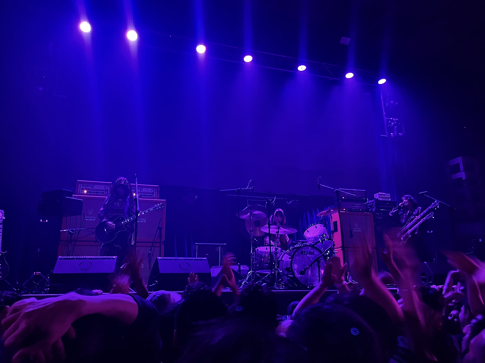

::: {.centrar}
{.foto}
:::

Ver a Boris en vivo fue un sueño hecho realidad, algo que pensaba imposible.

Escucho esta banda desde que iba en el colegio, y me han acompañado por tantas emociones y posibilidades sonoras. Amo la potencia del ruido y el sentimiento de sus frecuencias.

Boris me ha llevado por los distintos confines de la música extrema.

:::: {.centrar}
::: {.tiktok}
<iframe src="https://www.tiktok.com/embed/v2/7578728286402923797" height="740" width="400"></iframe>
:::
::::

Terminaron el concierto tocando Flood, una obra realmente increíble que mezcla el drone, el post rock, con el heavy rock que los caracteriza. 

:::: {.centrar}
::: {.tiktok}
<iframe src="https://www.tiktok.com/embed/v2/7578732051902237972" height="740" width="400"></iframe>
:::
::::

Dejo por acá una **playlist** que mantengo de esta increíble banda, con una discografía tan extensa que muchas veces necesito la playlist para poder encontrar los temones favoritos.

:::: {.centrar}
::: {.playlist}
<iframe allow="autoplay *; encrypted-media *;" frameborder="0" height="450" style="width:100%;overflow:hidden;background:transparent;" sandbox="allow-forms allow-popups allow-same-origin allow-scripts allow-storage-access-by-user-activation allow-top-navigation-by-user-activation" src="https://embed.music.apple.com/cl/playlist/favs-boris/pl.u-aZb0brvtVAYZ8g"></iframe>
:::
::::