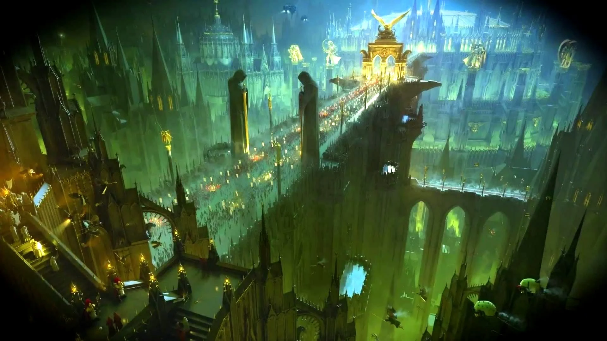

Esta es la lista de libros de Warhammer que he leído hasta la fecha. Warhammer 40.000 es un **universo de ciencia ficción** basado en un juego de mesa nacido en la Inglaterra de los años '80.

{.foto}

A grandes rasgos, Warhammer 40.000 es un universo compuesto por novelas, libros de reglas, videojuegos y audiovisuales que retrata el escenario de la situación de la humanidad en el milenio 41. La humanidad, unida bajo un gobierno interplanetario totalitario, esclavista y genocida, lucha por su supervivencia en una galaxia oprimida por el caos, la expresión paralela de la realidad material, una dimensión sin tiempo ni orden donde habitan los ecos de las emociones más extremas sufridas por los seres vivos, y que puede ser navegada en riesgosos viajes interdimensionales para atravesar el universo. 

La historia de Warhammer acontece en varios hilos temporales, el inicial aproximadamente durante el milenio 32, donde se relatan las cruzadas del imperio por reunir a la humanidad bajo un mismo estandarte, y el hilo
principal, situándose 10.000 años después del quiebre definitivo del proyecto del Imperio de la Humanidad, periodo durante el cual la civilización cayó en una era de oscuridad, degradación y fanatismo religioso.

A continuación están todos los libros de Warhammer que he leído a la fecha, en orden cronológico:

```{r cargar}
library(dplyr)
library(readr)
library(here)
library(janitor)

data <- read_csv(here("datos/goodreads_library_export.csv")) |> 
  clean_names()
```

```{r limpiar}
library(glue)
library(stringr)

libros <- data |> 
  select(date_read,
         title, author, publisher, my_rating, number_of_pages, 
         book_id) |> 
  filter(!is.na(date_read)) |> 
  # filtrar libros de Warhammer
  filter(
    when_any(
      str_detect(title, "Warhammer"),
      str_detect(title, "Horus Heresy"),
      str_detect(publisher, "Black Library")
    )) |> 
  # limpiar datos
  mutate(title = str_remove(title, "\\(.*\\)"),
         title = str_squish(title),
         author = str_squish(author)) |>
  # numero de páginas faltantes
  mutate(number_of_pages = case_when(title == "Ravenor" ~ 416,
                                     .default = number_of_pages)) |> 
  # columna con portadas de los libros
  mutate(portada = glue("portadas/{book_id}.jpg"),
         link = glue("https://www.goodreads.com/book/show/{book_id}"))
```


```{r portadas}
#| output: false

library(purrr)
library(rvest)

# por cada id de libro, descarga la portada
walk(libros$book_id, \(id) {
  message(id)
  
  # armar ruta de guardado
  ruta <- "posts/warhammer40k/portadas/"
  archivo <- glue("{ruta}{id}.jpg")
  
  # revisar si existe
  if (file.exists(here(archivo))) {
    message("imagen existente, saltando...")
    return()
  }
  
  url <- glue("https://www.goodreads.com/book/show/{id}")
  
  # extraer imagen de portada de la dirección
  imagen <- read_html(url) |> 
    html_elements(".BookCover__image") |> 
    html_element("img") |>
    html_attr("src") |> 
    unique()
  
  message("falta imagen, descargando...")
  inicio <- Sys.time() # medir tiempo de descarga
  
  # descargar imagen
  download.file(imagen, 
                destfile = here(archivo))
  
  # tiempo de espera entre descargas
  Sys.sleep(10* (Sys.time() - inicio)) 
})
```


```{r funciones}
# función para generar estrellas
estrellas <- function(rating, 
                      color_punto = "#E2B842", 
                      color_vacio = "#8F748E") {
  simbolo <- "\u2605"
  
  # por cada número del 1 al 5, hace un span con una estrella y revisa si es parte del puntaje o no, y le asigna un color y una clase; luego retorna los 5 elementos
  estrellas <- map(1:5, \(i) {
    
    # color dependiendo de si está dentro del rating
    color <- if_else(i <= rating, 
                     color_punto, 
                     color_vacio)
    
    # estrella individual
    span(simbolo,
         class = "estrella",
         style = glue("color: {color};")
    )
  })
  
  # salida con las 5 estrellas
  div(class = "estrellas", estrellas)
}


meses <- function(numero) {
  case_when(
    numero == 1 ~ "enero",
    numero == 2 ~ "febrero",
    numero == 3 ~ "marzo",
    numero == 4 ~ "abril",
    numero == 5 ~ "mayo",
    numero == 6 ~ "junio",
    numero == 7 ~ "julio",
    numero == 8 ~ "agosto",
    numero == 9 ~ "septiembre",
    numero == 10 ~ "octubre",
    numero == 11 ~ "noviembre",
    numero == 12 ~ "diciembre"
  )
}
```


```{r salida_html}
#| output: "asis"

library(shiny)
library(lubridate)

lista_libros <- libros |> split(~date_read)

div(class = "cuadricula", 
    style = "margin-top: 24px;",
    
    # generar elementos por cada libro
    map(lista_libros, \(libro) {
      
      # libro individual
      div(class = "contenedor_libro",
          
          # portada del libro
          div(class = "libro_imagen",
              a(href = libro$link,
                img(src = libro$portada, alt = libro$title)
              )
          ),
          
          # datos del libro
          p(class = "libro_titulo", libro$title),
          
          p(class = "libro_autor",libro$author),
          
          div(class = "libro_rating", estrellas(libro$my_rating)),
          
          p(class = "libro_paginas",
            glue("Leído en {meses(month(libro$date_read))} de {year(libro$date_read)}, {libro$number_of_pages} páginas")
          )
      )
      
    })
)
```


